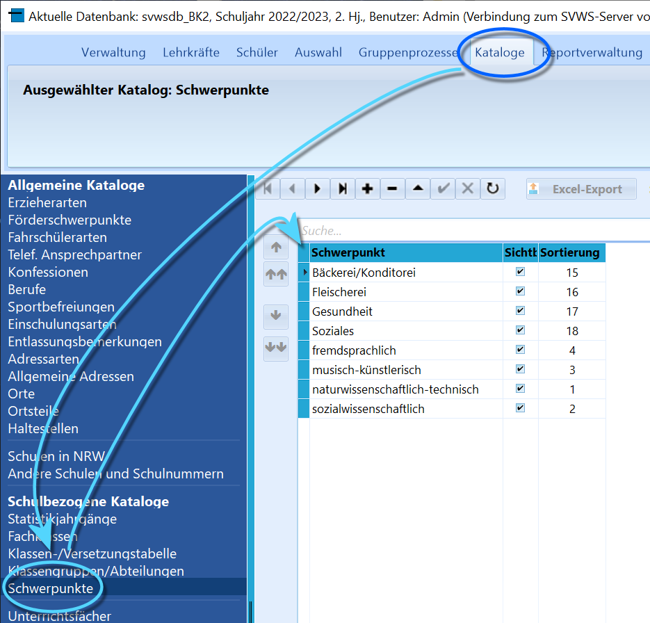
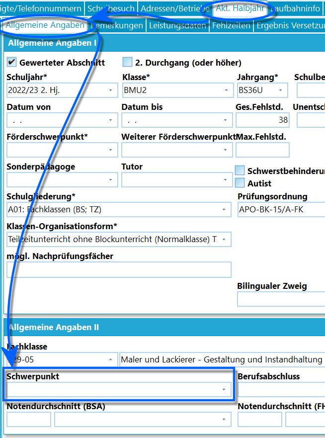

# Schwerpunkte (Schulbezogene Kataloge)

An einem BK können manche Bildungsgänge Schwerpunkte haben.

Diese Schwerpunkte werden über *Kataloge* ➜ **Schwerpunkte**
vorbereitet.Wie bei allen Katalogen gilt, dass sich die Sortierreihenfolge über eine
*benutzerdefinierte* Sortierung anpassen lässt.  

Der Eintrag des **Schwerpunkt**s findet dann in *Schüler ➜ Akt.
Abschnitt* unter *Allgemeine Angaben II* im Feld **Schwerpunkt**
entsprechend der Vorgaben des Bildungsganges statt.