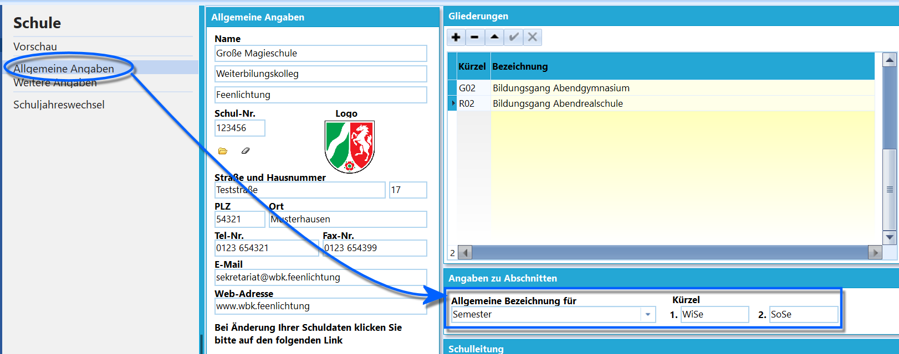
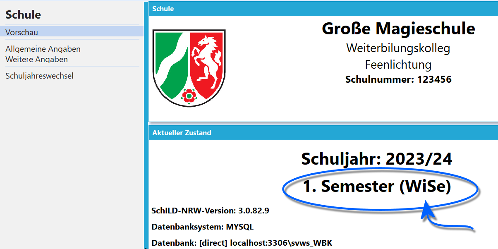

# Sommer- und Wintersemester an WBKs (Tutorial)

Am WBK setzen Sie *Sommer-* und *Wintersemester* über *Verwaltung ➜
Schule ➜ Allgemeine Angaben* ➜ **Angaben zu Abschnitten**.Benennen Sie die **Allgemeine Bezeichnung für** den Abschnitt. Hier im
Beispiel wurde *Semester* gewählt.Vergeben Sie passende **Kürzel**. Hier im Beispiel werden *WiSe* und
*SoSe* verwendet.  

 Die Bezeichnungen sind nun übernommen.Zum Beispiel in *Verwaltung ➜ Einstellungen ➜ Vorschau* sind die Kürzel
nun dem Semester hinzugefügt.Auch in der Kopfzeile von SchILD-NRW werden die Semesterkürzel korrekt
angezeigt.