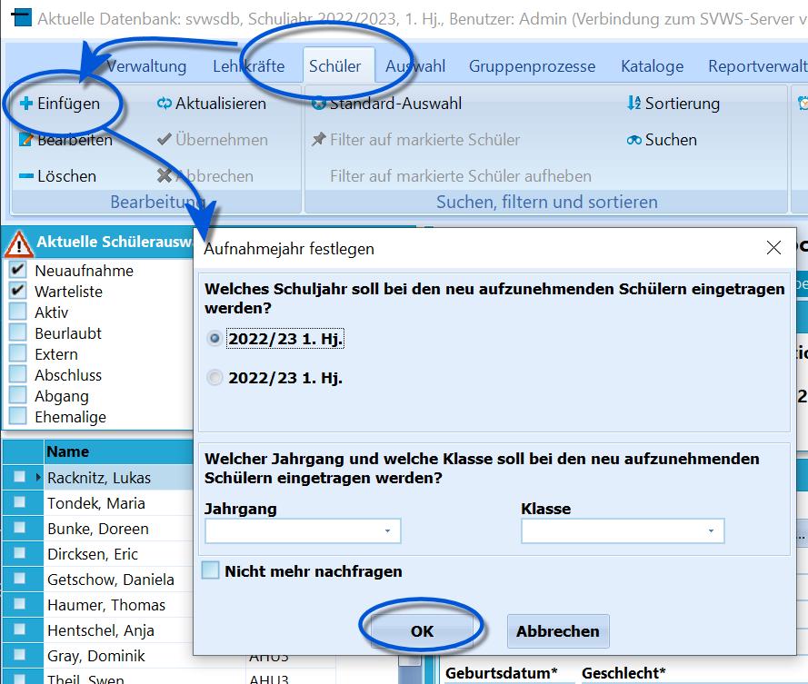
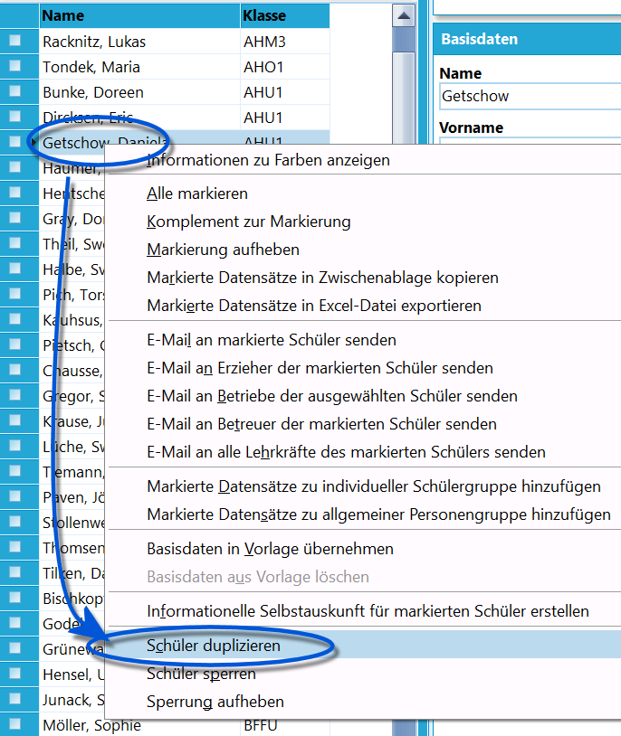
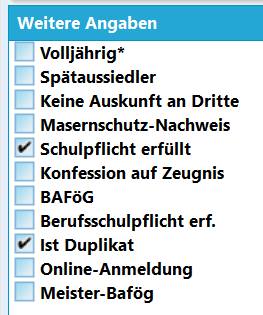
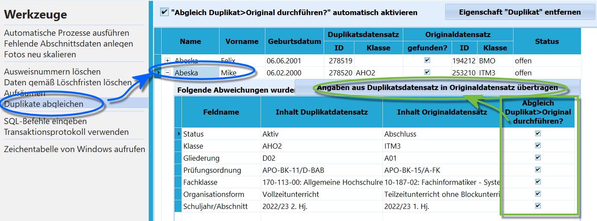

# Umgang mit Bildungsgangswechlsern am BK (Tutorial)

## Grundsätzliches Problem

Am BK kann es vorkommen, dass sich aktive Schüler für das kommende
Schuljahr für einen weiteren oder anderen Bildungsgang anmelden.Da sie aber in diesem Schuljahr noch aktiv sind, kann mit den bisher
vorhandenen Schülern nicht für das kommende Schuljahr geplant werden.
Diese Schüler werden hier als *"Original"* bezeichnet.Um für das neue Schuljahr planen zu können, werden von den aktiven
Schülern *"Duplikate"* in SchILD-NRW angelegt, mit denen dann das
kommende Schuljahr als Platzhalter, etwa bei der Klasseneinteilung
usw. - geplant werden kann.

Das *Original* können wir zum alten Schuljahr noch nicht umändern, da
die Daten des aktuellen Bildungsganges noch für Noten,
Abschlussberechnung und Zeugnisdruck benötigt werden.Wurde der Schuljahreswechsel dann abschlossen und damit auch der
Bildungsgang des bislang aktiven Schülers, können der *Original* - das
nun den **Status** *Abschluss* hat - und das *Duplikat* - das den
**Status** *Neuaufnahme* oder *Aktiv* hat wieder vereint oder
*"verschmolzen"* werden.Über die Vor- und Nachteile eines Verschmelzens steht weiter unten mehr.

## Schülerdatensatz erzeugen

## Bildungsgangwechsler ohne Online-Verfahren zur Anmeldung

## Aufnahme 1:

Neuaufnahme eines Schülers an der Schule

 Für den Fall, dass Schüler von einer anderen Schule kommen
und bei Ihrer Schule komplett neu aufgenommen werden, ohne dass eine
zurückliegende Laufbahn erfasst wird, ist nur das normale
Aufnahmeverfahren durchzuführen.Verwendet die Schule kein Online-Anmeldeverfahren, müssen die Daten
neuer Schüler manuell eingetragen werden.Tragen Sie in der Neuaufnahmemaske Jahrgang und Klasse. Dann pflegen Sie
wie üblich alle anderen notwendigen und bekannten Daten nach.  

## Aufnahme 2:

Duplizieren eines Schülers der eigenen Schule

 Handelt es sich um Schüler der eigenen Schule, die einen
weiteren Bildungsgang besuchen möchten, wird ein *Duplikat* des Schülers
angelegt.Klicken Sie mit der rechten Maustaste auf einen Schüler und wählen Sie
`Schüler duplizieren`.Hierdurch wird ein neuer Datensatz mit den Daten des Schülers angelegt,
welcher keine Angaben zu *Jahrgang, Klasse, Gliederung* und so weiter
hat.In SchILD-NRW 3 werden die Duplikate als *Neuaufnahme* im *kommenden
Lernabschnitt* angelegt.  

 Dieser Schüler ist gelb markiert um deutlich zu machen,
dass es sich um ein Duplikat handelt.

Dieses Attribut wird über den Haken **Ist Duplikat** unten rechts bei
*Weitere Angaben* gesteuert.

Damit der Schüler auch sichtbar ist, muss im Schüler der
Status *Neuaufnahme* ebenfalls im Filter enthalten sein.Weiterhin bietet es sich an, die Sortierung auf "Name, Vorname, Klasse"
zu ändern, damit das *Duplikat ohne Klasse* direkt beim *Original mit
Klasse* einsortiert wird.

## Aufnahme 3:
Bildungsgangwechsler mit Schüler-Online (oder anderen Verfahren)Exportiert man Schülerdaten aus Schüler-Online, wird der *Name* des
Schülers in der zu erzeugten Schnittstellendatei
*SchuelerBasisidaten.dat* durch *#neueKlasse* ergänzt.` Hansen`wird also zu` Hansen#AHM1`Wenn SchILD-NRW beim Import bereits einen Schülerdatensatz für den
gleichen Schüler findet, die Kriterien hierfür sind *Name*, *Vorname*
und das *Geburtsdatum*, wird dieser automatisch als *Duplikat*
eingetragen.Bei Verwendung anderer Online-Anmeldungen (OSA,…) sollte man versuchen,
die zu übertragende Datei genauso zu strukturieren, um den gleichen
Effekt beim Import zu erreichen.

Damit der Schüler auch sichtbar ist, muss im Schüler der
Status *Neuaufnahme* ebenfalls im Filter enthalten sein.Weiterhin bietet es sich an, die Sortierung auf "Name, Vorname, Klasse"
zu ändern, damit das *Duplikat mit anderer Klasse* direkt beim *Original
mit der alten Klasse* einsortiert wird.

## Schüler mit dem aktuellen Bildungsgang aktivieren

Unabhängig davon, auf welchem Weg die Schülerdatensätze in SchILD-NRW
aufgenommen wurden, ist der Name des neuen Schülers nun in der
Namensliste gelb hinterlegt, da der Haken bei **Ist Duplikat** gesetzt
wurde.

Das *Duplikat* wird nun so behandelt, als wäre es nach dem
Schuljahreswechsel der aktive Schüler, der im nächsten Schuljahr mit den
dann gültigen Angaben versehen wird.

Die weiteren Arbeiten erfolgen nach dem *Schuljahreswechsel*.Beim Schuljahreswechsel wurde das *Original*, also der Schüler des
abgelaufenen Schuljahres, automatisch in den **Status** *Abschluss*
gesetzt.Damit ist das Original nicht mehr im Schülercontainer der aktiven
Schüler zu sehen.

## Variante 1:
Nicht-Verschmelzen und Beibehalten beider DatensätzeEs wird das nun mit den aktuellen Daten versehene Duplikat weiter als
der aktuelle Schüler gepflegt.Hierbei muss lediglich der Haken bei **Ist Duplikat** entfernt werden.

Das *Original* verbleibt nun mit der alten Geschichte im alten
Bildungsgang im **Status** *Abschluss*.Nachteile des Verschmelzens:
-   beim aktiven Schüler ist ide vorherige Laufbahn mit den Noten nicht
    mehr aufgeführt.
-   Auch in vorherigen Bildungsgängen erreichte Abschlüsse sind nicht
    mehr abrufbar, da SchILD-NRW nur einen Bildungsgang-Abschluss pro
    Schüler speichert.
-   Mitunter können Schüler parallel zwei Bildungsgänge belegen.In diesen Fällen könnten die Schüler dupliziert, aber nicht
zusammengeführt werden.

Eine Möglichkeit, um auf das alte Original zu verweisen
wäre, einen *Vermerk* für den neuen Schüler zu verfassen, aus dem die
Existenz der weiteren Schülerversion hervorgeht.

### Variante 2: Verschmelzen von Duplikat und ursprünglichem DatensatzIn der zweiten Variante werden die beiden Versionen des Schülers
verschmolzen.Hierbei werden nun die aktuellen Daten beim *Original* eingetragen und
der **Status** wird von *Abschluss* wieder auf *Aktiv* geändert. Im
Anschluss ist das nun überflüssige Platzhalter-Duplikat zu löschen.Der Vorteil bei diesem Vorgehen ist, dass die Laufbahn mit allen
Anmerkungen, Eintragungen und Noten in einem Datensatz erhalten wird.

Achten Sie darauf, dass im Duplikat vorhandene
Leistungsdaten nicht übertragen werden. Lagen dort schon welche vor,
sind diese nach dem Verschmelzen beim Original nicht
vorhanden.

Um die Verschmelzung durchzuführen, muss das *Original* mit den

aktuellen Daten des *Duplikats* aktualisiert werden.-   Schul- und Halbjahr
-   Klasse
-   Prüfungsordnung, Bildungsgang, Bildungsgangbeginn
-   Bei Berufsschülern: Betrieb, Vertragsbeginn und -ende
-   Der Status wird von *Abschluss* auf *Aktiv* geändert

 Dieser Abgleich kann über *Verwaltung ➜ Werkzeuge* ➜
**Duplikate abgleichen** automatisiert vorgenommen werden.Wählen Sie beim gefundenen Duplikat die Felder an, die nun in das
Original geschrieben werden sollen.  
Dann klicken Sie auf
`Angaben aus Duplikatsdatensatz in Originaldatensatz übertragen` und die
gewählten Daten werden übernommen.Hierbei können auch veränderte Kontaktdaten, Adressen und so weiter zur
Aktualisierung ausgewählt werden.

Fand der Abgleich statt, wird das *Duplikat* automatisch
gelöscht.

