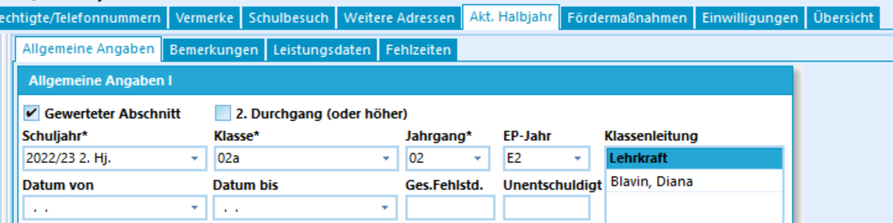

# Eintragung der EP-Jahre (Tutorial)

In der Grundschule fallen die Jahrgänge E1, E2 und E3 der
Schuleingangsphase weg. Es werden nur noch die reinen Jahrgänge 01, 02,
03 und 04 erfasst.Der Verbleib in der Schuleingangsphase wird in den zum Jahrgang
gehörenden *Lernabschnitt* erfasst. Hier wird neben dem *Jahrgang* auch
das Feld **EP-Jahr** befüllt, in das nun entsprechend *E1*, *E2* oder
*E3* eingetragen werden kann.Beim Export nach ASDPC im Zuge der Statistik wird der Jahrgang
automatisch korrekt auf die von ASDPC erwarteten Werte gesetzt.  
Im Abschluss bekommen Sie die EP-Jahre auch in den *Individualdaten I*
im Bereich *Aktuelle Laufbahn* angezeigt.