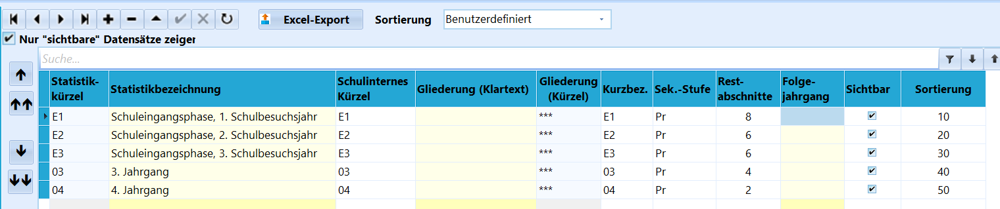
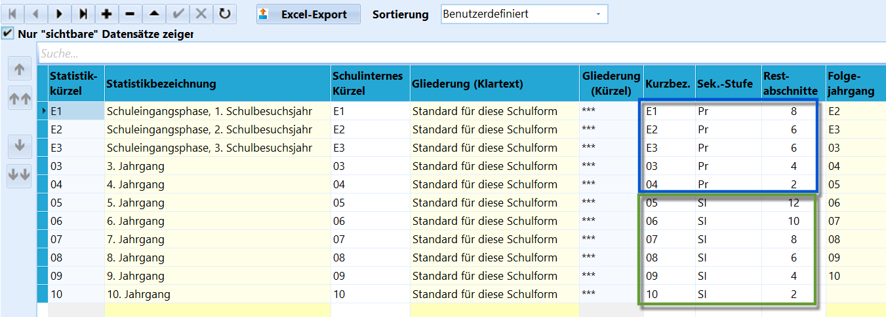
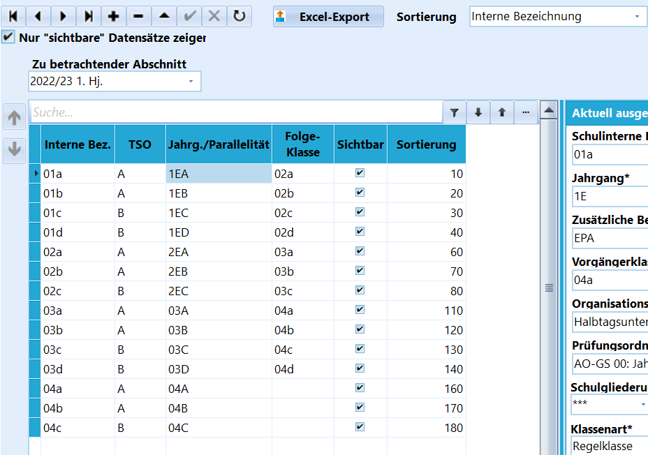
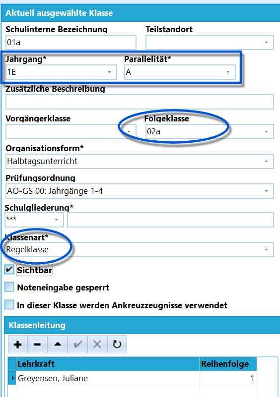
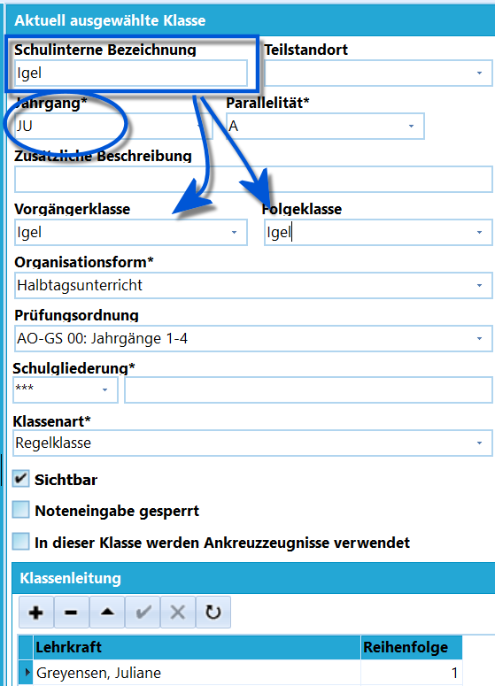
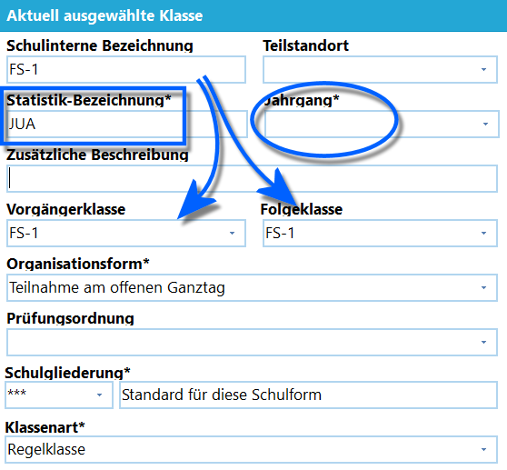

# Versetzungstabelle bei jahrgangsgemischten Klassen (Tutorial)

## Die Jahrgangstabelle in Kataloge ➜ Statistikjahrgänge

 In allen *Grundschulen* muss die Tabelle *Kataloge* ➜
**Statistikjahrgänge** unabhängig von der Unterrichtsorganisation wie im
Screenshot abgebildet werden.

Die Tabelle enthält die Schülerjahrgänge E1, E2, E3, 03 und 04 mit den
zugehörigen *Restabschnitten*, also in der Regel die zu Beginn des
Jahrgangs verbleibenden Halbjahre, und bildet somit ab, welche Jahrgänge
grundsätzlich in der Schule vorkommen.

Die Bezeichnungen für die Schuleingangsphase E1 und E2 werden statt der
Jahrgangsbezeichnungen 01 und 02 für die ersten beiden Jahrgänge der
Schuleingangsphase verwendet.

Die Jahrgangsbezeichnung E3 ist Schülern vorbehalten, welche die zweite
Klasse wiederholen und somit ein drittes Jahr in der Schuleingangsphase
bleiben. Ebenso werden Schüler, die das erste Jahr der
Schuleingangsphase wiederholen und damit ihre "zweite 1. Klasse" im
Jahrgang E2 sind, in ihrer dann folgenden 2. Klasse im Jahrgang E3
erscheinen.

Die oben abgebildete Tabelle zeigt eine sinnvolle Sortierung der
Jahrgänge. Um eine eigene Sortierung vornehmen zu können, wird die
**Sortierung** oben in der Kopfzeile auf *Benutzerdefiniert* gestellt.
Dann können die Einträge mittels der schwarzen Pfeile links verschoben
werden.  

In der *Förderschule* schließen sich an diesen Primarstufenblock die
höheren Jahrgangstufen mit den neuen **Restabschnitt**en von Jahrgang 05
bis 10 und der neuen **Sek.-Stufe**, der *SI*, an.  

## Klassenversetzungstabelle

In der *Klassen-/Versetzungstabelle* werden die Klassen definiert.

Schauen Sie hierzu grundsätzlich in den Artikel zu
dieser in der Rubrik *Kataloge* dieses Wikis.

In diesem Tutorial ist die Hauptansicht relevant, in der tabellarisch

die **Klassen** und ihre **Folgeklassen** aufgeführt werden.Bei den **Klassen** kann die **Interne Bezeichnung** frei gewählt
werden. Ob Ihre Schule die ersten Klassen 1.1 und 1.2 oder 1A und 1B
oder die "Adler" und die "Bieber" nennt, ist Ihnen überlassen. Beachten
Sie die Zeichenbeschränkung, die nur kurze Tierbezeichnungen zulässt.

Die **Parallelität** hingegen ist statistikrelevant und folgt dem
Schema, dass zuerst zweistellig der Jahrgang steht, dann folgt
aufsteigend das Alphabet in Großbuchstaben, wie es auch im Beleg mit den
Klassendaten (KLD) im Statistikprogramm ASDPC32 gehandhabt wird: also
für die ersten beiden Klassen des 1. Jahrgangs sind dies 1EA, 1EA oder
im dritten Jahrgang werden die ersten beiden Klassen als 03A und 03B
erfasst.In dieser Tabelle ist die Schule noch auf zwei Teilstandorte (Spalte
**TSO**) mit den Standorten *A* und *B* aufgeteilt.  

# Beispiele für Klassenversetzungstabellen

## Grundschule mit jahrgangsbezogenem Unterricht

 Die *Klassen-Versetzungstabelle* an sich wird bei
jahrgangsbezogenem Unterricht wie im Beispielscreenshot oben ausgefüllt.Im Screenshot rechts sind die Details einer *Beispielklasse* zu sehen.Es gibt keine Besonderheiten zu beachten:-   es werden lediglich die Klassenjahrgänge *1E*, *2E*, *03* und *04*
    verwendet.
-   die **Parallelität** wird bei den Klassen nur alphabetisch A, B, C,
    ... hochgesetzt.
-   bei jeder **Klassenart** handelt es sich um eine *Regelklasse*.
-   es wird eine **Folgeklasse** gesetzt. Im Jahrgang 1E gibt es keine
    Vorgängerklasse, im Jahrgang 04 bleibt die Folgeklasse leer.Ist das Feld **Folgeklasse** leer, versetzt Schild diese Schüler in den
**Status** *Abschluss*, sofern kein anderer Versetzungsvermerk gesetzt
wurde und damit sind diese Schüler keine aktiven Schüler der Schule
mehr.  
Die unten abgebildete Tabelle gibt einen exemplarischen Überblick über
die vorzunehmenden Einträge einer zweizügigen Grundschule mit
jahrgangsbezogenem Halbtagsunterricht.| Schulinterne Bez. | Jahrgang | Parallelität | Folge-Klasse | Vorgänger-Klasse | Klassenart  |
|-------|----------|--|--|------|-|
| 01A               | 1E       | A            | 02A          |                  | Regelklasse |
| 01B               | 1E       | B            | 02B          |                  | Regelklasse |
| 02A               | 2E       | A            | 03A          | 01A              | Regelklasse |
| 02B               | 2E       | B            | 03B          | 01B              | Regelklasse |
| 03A               | 03       | A            | 04A          | 02A              | Regelklasse |
| 03B               | 03       | B            | 04B          | 02B              | Regelklasse |
| 04A               | 04       | A            |              | 03A              | Regelklasse |
| 04B               | 04       | B            |              | 03B              | Regelklasse |

## Grundschule mit jahrgangsübergreifendem Unterricht in der Schuleingangsphase

 Die Klassen-Versetzungstabelle wird bei
jahrgangsübergreifendem Unterricht wie im Screenshot ausgefüllt.-   Der Jahrgang wird zu *JU*.
-   Auf die aktuelle Klasse folgt in der Schuleingangsphase als
    **Folgeklasse** wieder die gleiche Klasse. Ein Übergang beim
    Schuljahreswechsel findet somit "von dieser Klasse in diese Klasse"
    statt.
-   Als **Klassenart** wird immer *Regelklasse* eingetragen.
-   Nach der jahrgangsübergreifenden Schuleingangsphase gehen die
    Schüler in die normale Klassenstruktur mit den Jahrgängen 03 und 04
    über.Der Übergang zur 03 ist manuell oder per Gruppenprozess vorzunehmen, da
SchILD-NRW nicht wissen kann, wie die Schüler individuell auf die
Folgeklassen im Jahrgang 03 verteilt werden.Der Übergang von der 03 zur 04 entspricht in der Regel dem normalen
Schema, dass auf die, beispielsweise, "3a" die passende "4a" als
Folgeklasse eingetragen wird. Tragen Sie dann hier passend auch im
Jahrgang 4 die passenden **Vorgängerklasse**n ein.Eine Änderung der Klasse muss bei den Schülern manuell oder per
Gruppenprozess eingetragen werden.  
Die unten abgebildete Tabelle gibt einen exemplarischen Überblick über
die vorzunehmenden Einträge einer zweizügigen Grundschule mit
jahrgangsübergreifendem Halbtagsunterricht in der Schuleingangsphase.In der Tabelle erkennt man, dass an der Schule lediglich die
Klassenjahrgänge JU, 03 und 04 verwendet werden, E1, E2 und E3 der
Schuleingangsphase werden hier nicht differenziert.| Schulinterne Bez. | Jahrgang | Parallelität | Folge-Klasse | Vorgänger-Klasse | Klassenart  |
|-------|----------|--|--|------|-|
| Ameisen           | JU       | A            | Ameisen      | Ameisen          | Regelklasse |
| Bison             | JU       | B            | Bison        | Bison            | Regelklasse |
| Condor            | JU       | C            | Condor       | Condor           | Regelklasse |
| Dromedar          | JU       | D            | Dromedar     | Dromedar         | Regelklasse |
| 03A               | 03       | A            | 04A          |                  | Regelklasse |
| 03B               | 03       | B            | 04B          |                  | Regelklasse |
| 04A               | 04       | A            |              | 03A              | Regelklasse |
| 04B               | 04       | B            |              | 03B              | Regelklasse |

## Grundschule mit jahrgangsübergreifendem Unterricht in allen Jahrgängen

In Falle des jahrgangsübergreifenden Unterrichts in allen Jahrgängen ist
wie im vorherigen Beispiel zu verfahren, nur dass der Jahrgang *JU* für
alle Jahrgänge und nicht nur die der Schuleingangsphase gesetzt werden.-   Es wird lediglich der **Jahrgang** *JU* verwendet.
-   Als **Klassenart** wird immer *Regelklasse* eingetragen.
-   In allen Klassen wird als **Folgeklasse** und **Vorgängerklasse**
    die eigene Klasse eingetragen, da die Schüler in der Regel in den
    Klassen verbleiben.Eine Änderung der Klasse muss bei den Schülern manuell oder per
Gruppenprozess eingetragen werden.

Die unten abgebildete Tabelle gibt einen exemplarischen Überblick über
die vorzunehmenden Einträge einer zweizügigen Grundschule mit
jahrgangsübergreifendem Halbtagsunterricht.| Schulinterne Bez. | Jahrgang | Parallelität | Folge-Klasse | Vorgänger-Klasse | Klassenart  |
|-------|----------|--|--|------|-|
| Adler             | JU       | A            | Adler        | Adler            | Regelklasse |
| Bären             | JU       | B            | Bären        | Bären            | Regelklasse |
| Chamäleon         | JU       | C            | Chamäleon    | Chamäleon        | Regelklasse |
| Dachs             | JU       | D            | Dachs        | Dachs            | Regelklasse |
| Eisbär            | JU       | E            | Eisbär       | Eisbär           | Regelklasse |
| Flamingo          | JU       | F            | Flamingo     | Flamingo         | Regelklasse |
| Giraffen          | JU       | G            | Giraffen     | Giraffen         | Regelklasse |
| Hasen             | JU       | H            | Hasen        | Hasen            | Regelklasse |

## Förderschulen: jahrgangsübergreifende Klassen

 Förderschulen haben über die Grundschulen hinaus die
Ansicht von weiterführenden Schulen. Dort müssen die Eintragungen der
jahrgangsgemischten Klassen folgendermaßen erfolgen:-   Bei der **Statistikbezeichnung** der Klasse ist JUA, JUB, JUC … JUZ
    einzutragen, wobei *JU* für *"Jahrgangsübergreifend"* steht und
    *A*-*Z* die **Parallelität** darstellt. Diese wird für jede weitere
    Klasse Buchstabe für Buchstabe hochgezählt.
-   Der Jahrgang bleibt leer.
-   Ohne Jahrgang lässt sich auch keine **Prüfungsordnung** zuordnen,
    dieser Eintrag bleibt somit ebenfalls leer.
-   Die **Vorgängerklasse** und die **Folgeklasse** sind wieder
    identisch zur aktuellen Klasse.
-   Die **Klassenart** ist eine *Regelklasse*.