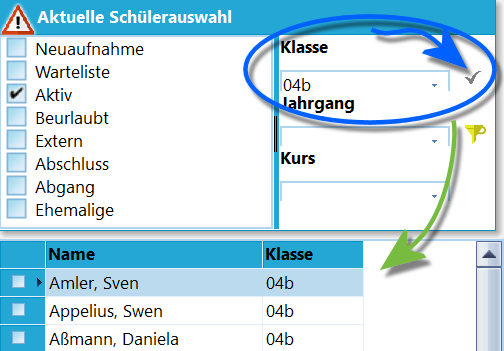
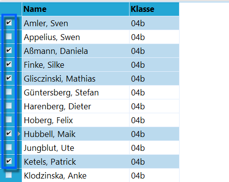
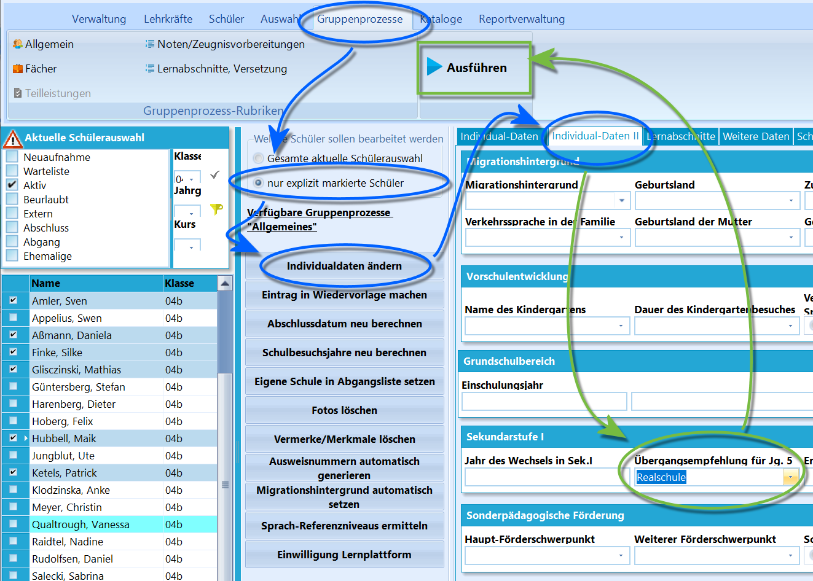

# Übergangsempfehlungen in Klasse 04 setzen (Tutorial)

In diesem Tutorial wird erklärt, wie die *Übergangsempfehlung* zum Ende
von Jahrgang 4 per *Gruppenprozess* gesetzt wird.

Soll die Übergangsempfehlung bei einzelnen Schülern
manuell gesetzt werden, findet sich dieses Feld unter *Individualdaten
II Grundschulbesuch* als Dropdown-Menü **Übergangsempfehlung für JG.
5**.

Dies ist für nachträgliche Änderungen nützlich oder falls eine
Empfehlung nur an so wenige oder einzelne Schüler vergeben wird, so dass
sich die Verwendung des Gruppenprozesses nicht anbietet.

Das Feld ist *statistikrelevant* und daher auch verpflichtend
auszufüllen.

Mögliche Einträge in diesem Feld sind-   *Hauptschule*

-   *Hauptschule / Realschule (eingeschränkt)*
-   *Realschule*
-   *Realschule / Gymnasium (eingeschränkt)*
-   *Gymnasium*
-   *Keine Empfehlung*

Dieser Eintrag ist auch per Gruppenprozess für mehrere Schüler
gleichzeitig zu setzen.

 Filter Sie zuerst auf die Schülergruppe, die bearbeitet
werden soll. In der Praxis wäre das entweder der ganze *Jahrgang 04*
oder die Bearbeitung klassenweise. Hier im Beispiel wird auf die *Klasse
04b* gefiltert.  

 Über die Checkbox vor den Schülern werden nun alle Personen
gewählt, welche die gleiche Übergangsempfehlung erhalten sollen.  

Die Empfehlung lässt sich nun über *Gruppenprozesse* ➜ **Individualdaten
ändern** eintragen.Sie finden das Feld **Übergangsempfehlung für Jg. 5** im Reiter
*Individualdaten II*.Achten Sie darauf, dass links über den Gruppenprozessen **nur explizit
markierte Schüler** angewählt ist. Wenn Sie Schüler markiert haben,
sollte dies schon per Standard der Fall sein.Tragen Sie dann im Feld **Übergangsempfehlung für Jg. 5** den für die
ausgewählte Gruppe passenden Wert ein.Klicken Sie dann auf `Ausführen`.

Die Übergangsempfehlungen sind nun gesetzt.