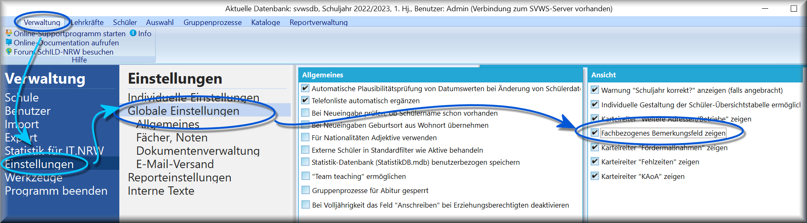
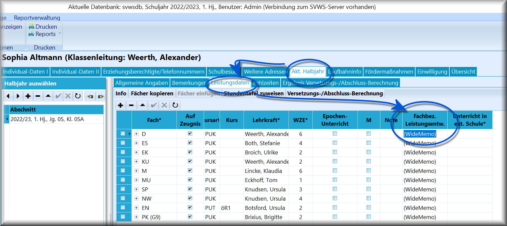
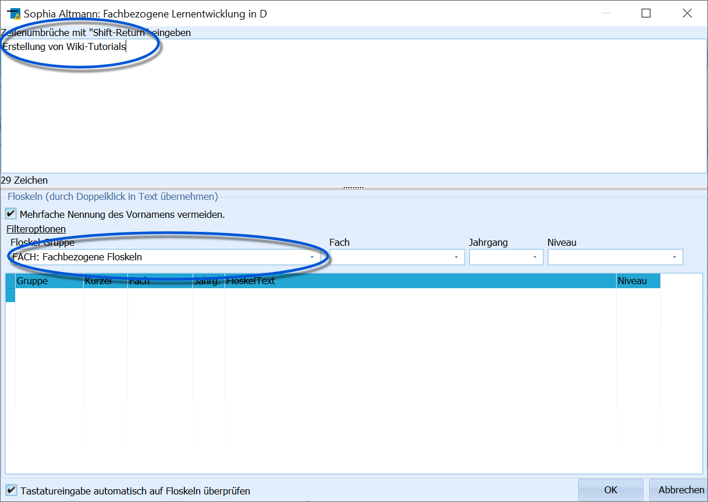
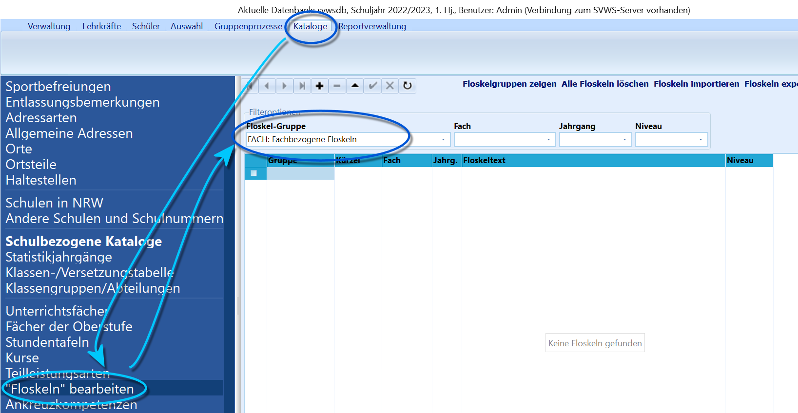
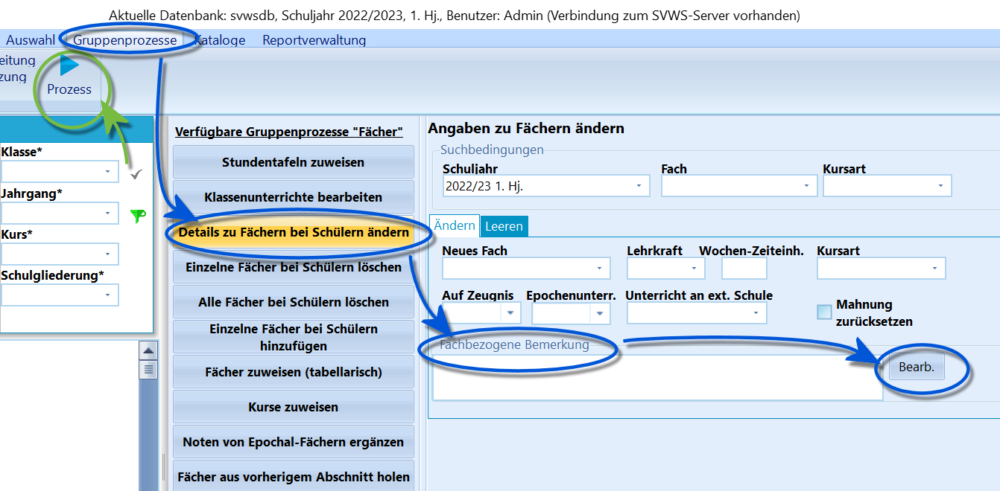

# Fachbezogene Bemerkungen (Tutorial)

Fachbezogene Bemerkungen können freie Texteinträge zu beliebigen
Unterrichtsfächern bei jedem einzelnen Schüler enthalten.Dazu können diese Bemerkungen einzeln oder auch als Gruppenprozess bei
mehreren Schülern gleichzeitig eingetragen werden.

## Fachbezogene Bemerkungen in SchILD aktivieren

 Aktiveren Sie das Feld für *Fachbezogene Bemerkungen* über
*Verwaltung ➜ Einstellungen ➜ Globale Einstellungen*. Dort findet sich
unter *Ansicht* der Haken, mit dem **Fachbezogene Bemerkungen** in
SchILD aktiviert werden können.  

## Bemerkungen verwenden

 Ist diese Option aktiviert steht Ihnen unter dem
Karteireiter *Schüler ➜ Akt. Halbjahr ➜ Leistungsdaten* ein Memofeld
*Fachbez. Leistungsentw.* am Ende der Fächerliste zur Verfügung.  

 Ein Doppelklick auf das Memofeld öffnet den aus Schild-NRW
bekannten Texteditor und lässt nun eine freie Texteingabe zu.Es können zu allen Fächern Bemerkungen gemacht werden.  

## Floskeln definieren

 Über *Kataloge ➜ Floskeln bearbeiten* können in der
*Floskel-Gruppe "FACH"* auch Bemerkungen schon - verbindlich? -
vordefiniert werden, die sich dann per Doppelklick einfügen lassen.  

## Fachbezogene Bemerkungen per Gruppenprozess eintragen

 Über *Gruppenprozesse ➜ Details zu Fächern bei Schülern
ändern* lässt sich unter *Fachbezogene Bemerkung* eine solche bei einer
im Container ausgewählten Schülermenge eintragen.Klicken Sie hierzu auf **Bearb.**, so dass sich das von den
Individualeintragungen bekannte Fenster öffnet. Über dieses werden
eigene Eintragungen vorgenommen oder Floskeln ausgewählt.Ein Klick auf **Prozess** oben links bei den Gruppenprozessen startet
die Eintragung.