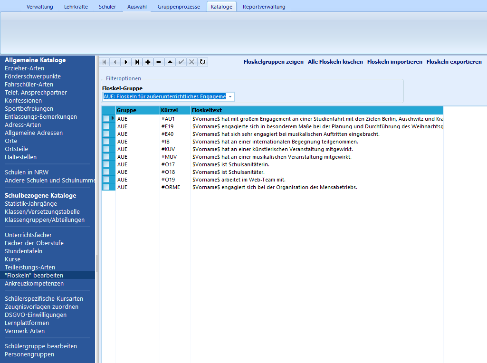
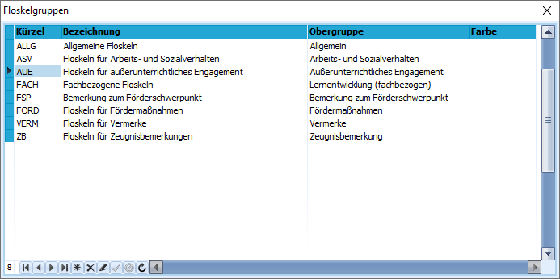
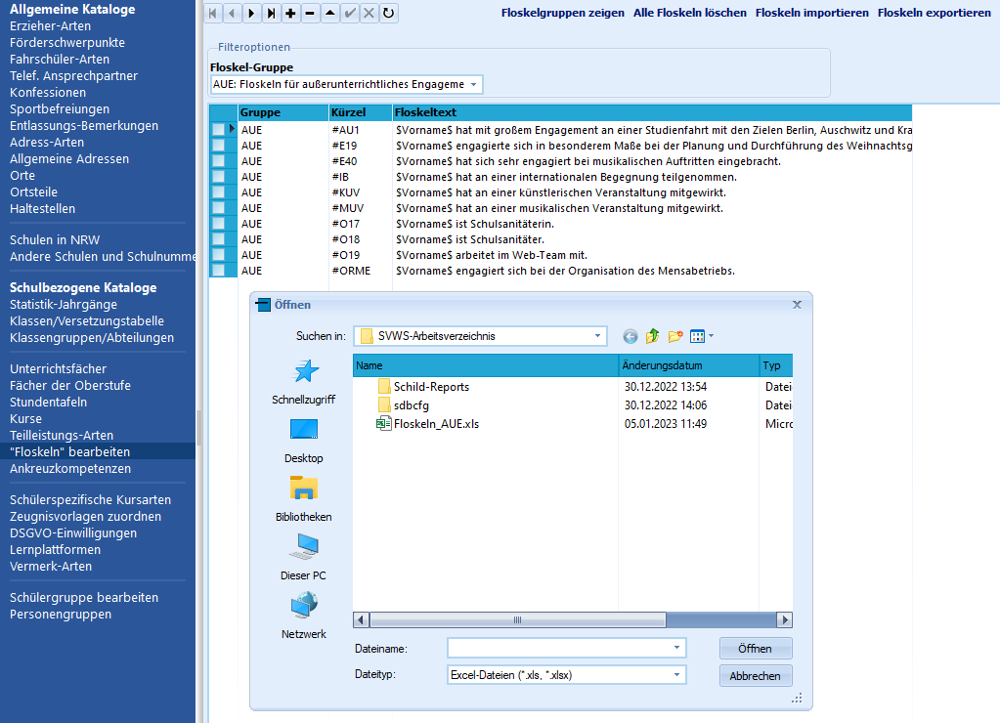
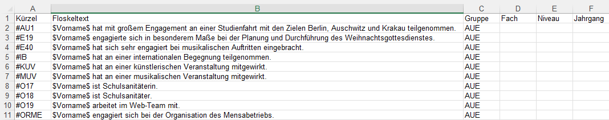
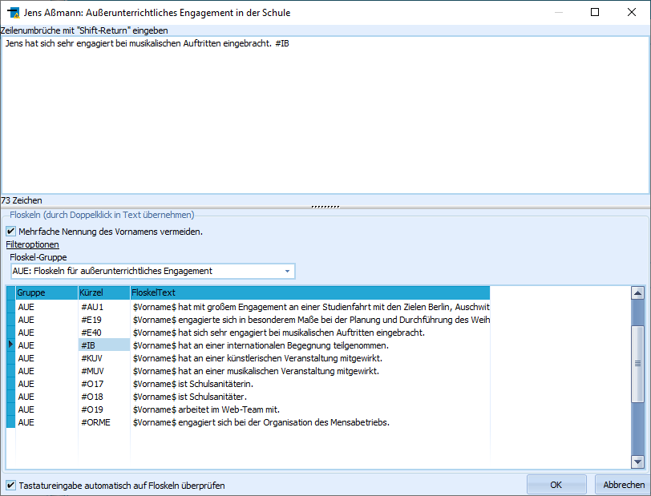

# Floskeln bearbeiten (Schulbezogene Kataloge)

In Schild-NRW gibt es sogenannte Floskeln. Dies sind wiederkehrende
Bemerkungen, die in Zeugnisbemerkungen, Bemerkungen zum Arbeits- und
Sozialverhalten, Angaben zum außerunterrichtlichen Engagement oder den
fachbezogenen Bemerkungen vorkommen können. Außerdem können Floskeln für
Textzeugnisse angelegt werden.Um diese Bemerkungen nicht immer eintippen zu müssen, können sie in
Schild-NRW mit einem Kürzel hinterlegt werden und so im Zeugnisdruck
schnell aufgerufen werden.  

# Verwaltung von Floskeln

## Floskelgruppen

 Floskeln sind in Floskelgruppen sortiert. Diese Gruppen
werden automatisch z. B. bei Eingabe in den jeweiligen
Bemerkungsfenstern bei der Zeugnisvorbereitung (Schüler ➜ Akt.
Quartal/Halbjahr ➜ Bemerkungen) vorausgewählt, so dass die gewünschten
Floskeln schneller gefunden werden können.Im Beispiel ist die Floskelgruppe "AUE: Floskeln für
außerunterrichtliches Engagement" ausgewählt.  

 Durch Klick auf "Floskelgruppen zeigen" können alle
Floskelgruppen bearbeitet werden.Hier können individuelle Farben ausgewählt werden. Außerdem können zu
einer Obergruppe neue Floskelgruppen angelegt werden.So kann in den Bemerkungsfenstern bei der Zeugnisvorbereitung gezielter
unterteilt und gesteuert werden, welche Floskeln dort erscheinen.Floskeln der Obergruppe "Allgemein" erscheinen in allen
Bemerkungsfeldern.Für die Bezeichnung können maximal vier Buchstaben/Ziffern verwendet
werden. Das Feld "Bezeichnung" muss ebenfalls ausgefüllt sein.

 warnin

g
 Wenn keine Obergruppe eingegeben ist, kann die
angelegte Floskelgruppe und alle darin angelegten Floskeln nur dann
gefunden werden, wenn in den Zeugnis-Bemerkungsfeldern die Filterung
ausgeestellt ist.

## Floskeln
In der Grundansicht des Katalogs "Floskeln bearbeiten" können über die
Schaltflächen am oberen Rand neue Floskeln angelegt bzw. bestehende
Floskeln gelöscht oder bearbeitet werden.Bei Neuanlage einer Floskel muss das Feld des Floskeltexts ausgefüllt
werden. Das Feld des Kürzels wird von SchILD-NRW automatisch ausgefüllt,
wenn keine Eingabe erfolgt.Es empfiehlt sich aber, hier ein einfach zu merkendes Kürzel
einzustellen, da dieses bei der Eingabe der Zeugnisbemerkungen
automatisch ersetzt werden kann.

Damit Daten bei Änderung oder Neuanlage einer Floskel
übernommen werden, muss entweder mit der Maus zu einem anderen Datensatz
gewechselt werden oder die Haken-Schaltfläche am oberen Rand geklickt
werden.

## Platzhalter

In den Floskeln können drei Platzhalter verwendet werden, die dann vom
Programm automatisch ersetzt werden. Diese Platzhalter müssen exakt so
geschrieben werden. Sie werden von Dollar-Zeichen ($) eingefasst:
-   $Vorname$
-   $Name$ (fügt den Nachnamen ein)
-   $Nachname$ (fügt den Nachnamen ein)Daneben können noch geschlechtsspezifische Platzhalter verwendet werden,
die dann je nach Geschlecht des Schülers oder der Schülerin eingesetzt
werden.

Diese Platzhalter können frei gewählt werden. Sie werden von Und-Zeichen
(&) eingefasst. Die zuerst genannte männliche Form wird mit einem
Prozent-Zeichen (%) von der weiblichen Form getrennt:Beispiel:
` &Klassenbuchführer%Klassenbuchführerin&  (&männliche_Bezeichnung%weibliche_Bezeichnung&)`

## Massenhaftes Bearbeiten von Floskeln
**Alle Floskeln löschen**Durch Klick auf diese Schaltfläche werden nach Bestätigung einer Abfrage
alle Floskeln gelöscht, die in der momentanen Ansicht gezeigt werden.
**Floskeln importieren** 

 

 Durch Klick auf diese
Schaltfläche kann eine Excel-Datei ausgewählt werden, die vorbereitete
Floskeln enthält.

Dies bietet den Vorteil einer einfacheren Bearbeitung der Floskellisten
im Gegensatz zur Bearbeitung direkt in SchILD.Außerdem können Floskellisten importiert werden, die auf der
Schulverwaltungsseite zur Verfügung gestellt werden.Insbesondere können so zügig Vorlagen für Textzeugnisse importiert
werden, die mit den Report-/Zeugnispaketen der entsprechenden
Schulformen zur Verfügung gestellt werden.**Floskeln exportieren**Umgekehrt können die in der aktuellen Ansicht gezeigten Floskeln in eine
Excel-Datei exportiert werden.

Dies sollte insbesondere nach umfangreichen Änderungen an den Floskeln
geschehen, um die Daten zu sichern.Als Standard-Ausgabeverzeichnis ist das SVWS-Arbeitsverzeichnis
ausgewählt.Natürlich kann auch jedes andere Verzeichnis auf dem Datenträger, einer
Serveradresse (bei entsprechender Berechtigung) oder einem externen
Datenträger gewählt werden.

Beachten Sie, die auf Zeugnissen verwendeten Floskeln
endgültig auf der Schulkonferenz beschlossen werden.

## Verwendung von Floskeln

 An verschiedenen Stellen in SchILD können die Floskeln im
Editor genutzt werden. Der Editor für diese Bemerkungen filtert nun nach
Floskelgruppe vor, je nachdem an welcher Stelle in SchILD der Editor
aufgerufen wird.Der Editor steht an folgenden Stellen zur Verfügung:-   Schüler ➜ Akt. Quartal/Halbjahr ➜ Bemerkungen
-   Schüler ➜ Akt. Quartal/Halbjahr ➜ Leistungsdaten ➜ Fachbez.
    Leistungsentw.
-   Schüler ➜ Laufbahninfo ➜ Vermerke (Doppelklick in das Feld
    Bemerkung)
-   Schüler ➜ Fördermaßnahmen (Doppelklick in das Feld XXX)

Die Filterung kann dann über "Filteroptionen" manuell aufgehoben oder
geändert werden. Zusätzlich kann für eine bessere Lesbarkeit z. B. auf
Zeugnissen angewählt werden, dass Vornamen nicht mehrfach genannt
werden.

Die fachbezogene Leistungsentwicklung steht erst zur
Verfügung, wenn sie unter Verwaltung ➜ Einstellungen ➜ Globale
Einstellungen: Allgemeines ➜ Ansicht aktiviert wurde.

Der Editor ermöglicht es außerdem, die Tastatureingabe automatisch auf

Floskeln zu überprüfen.Ist dies am unteren Rand des Editors aktiviert, genügt es, das Kürzel
der Floskel einzugeben und dann die Eingabetaste zu drücken.Der Floskeltext wird automatisch eingesetzt. Diese Option bietet sich
besonders dann an, wenn Floskeln häufig verwendet werden.Bei der fachbezogenen Leistungsentwicklung kann ein Jahrgang und ein
Niveau vergeben werden. So können die Kategorien für den Zeugnisdruck
bei Textzeugnissen aufgebaut werden.

Sollen Floskeln zum Beispiel als Zeugnisbemerkungen für
ganze Schülergruppen eingetragen werden, sollte anstelle einer manuellen
Eingabe bei jeder einzelnen Schülerin oder jedem einzelnen Schüler der
entsprechende Gruppenprozess verwendet werden. Verwenden Sie
*Gruppenprozesse ➜ Noten, Zeugnisvorbereitung* ➜ **Zeugnisbemerkungen
eintragen**.

