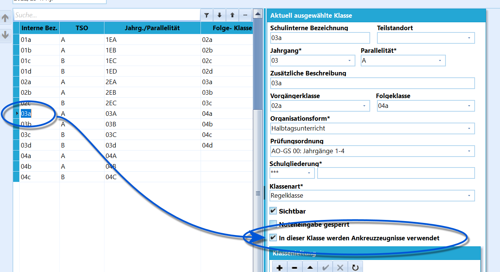
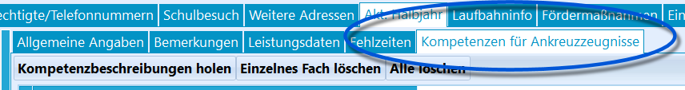
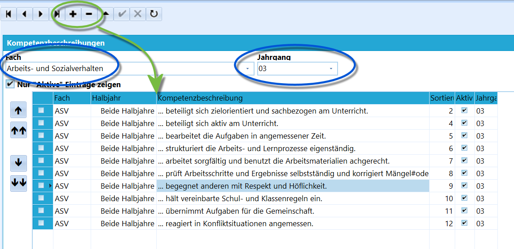
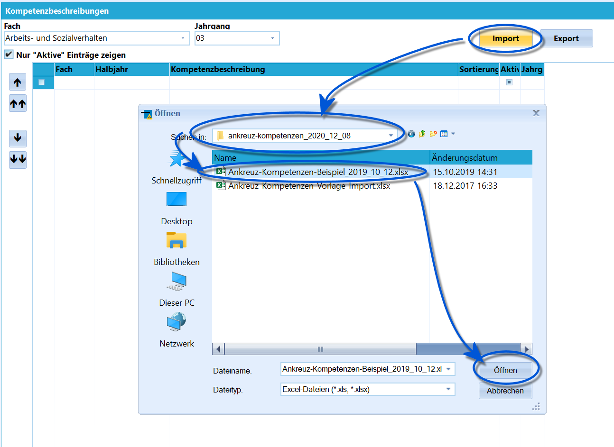
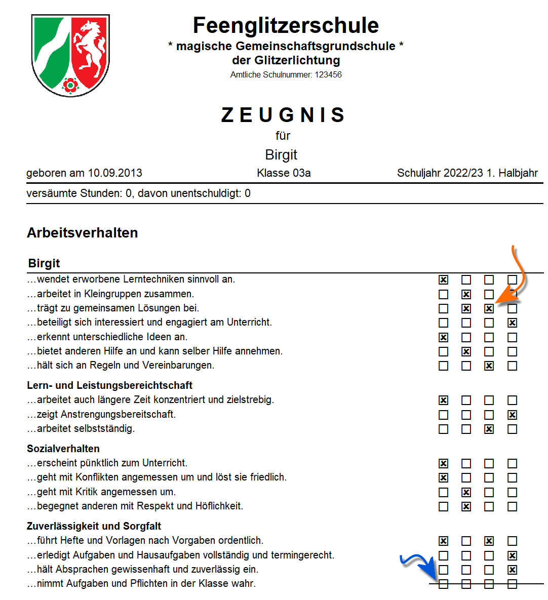
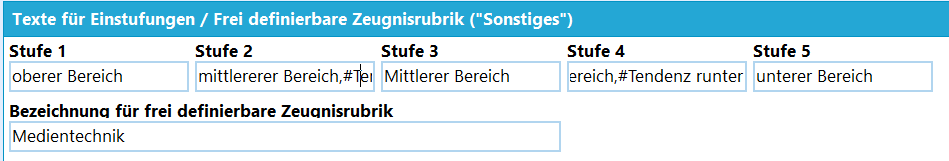
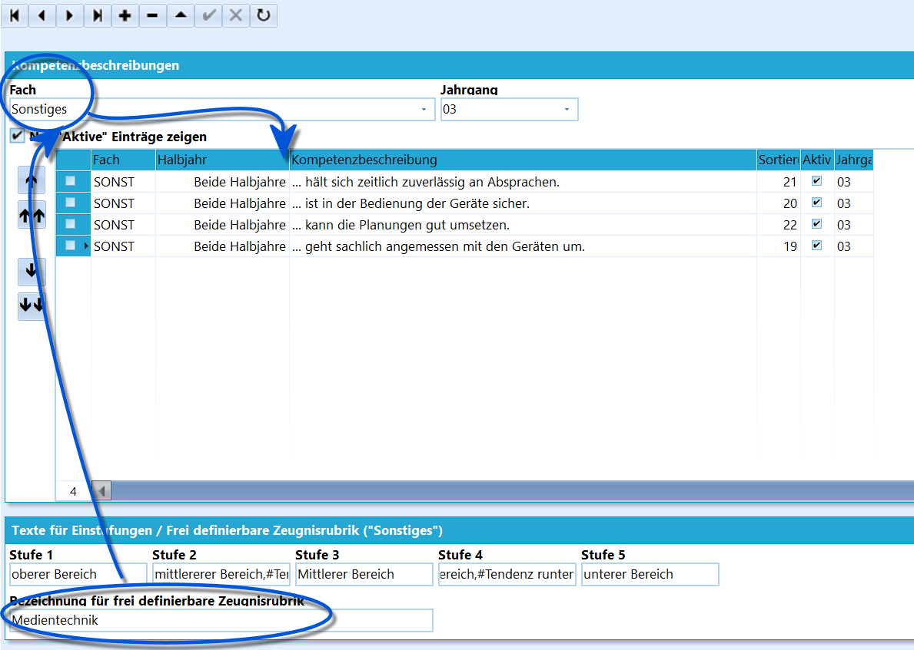
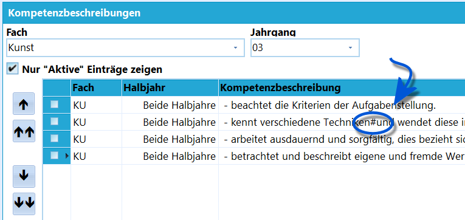
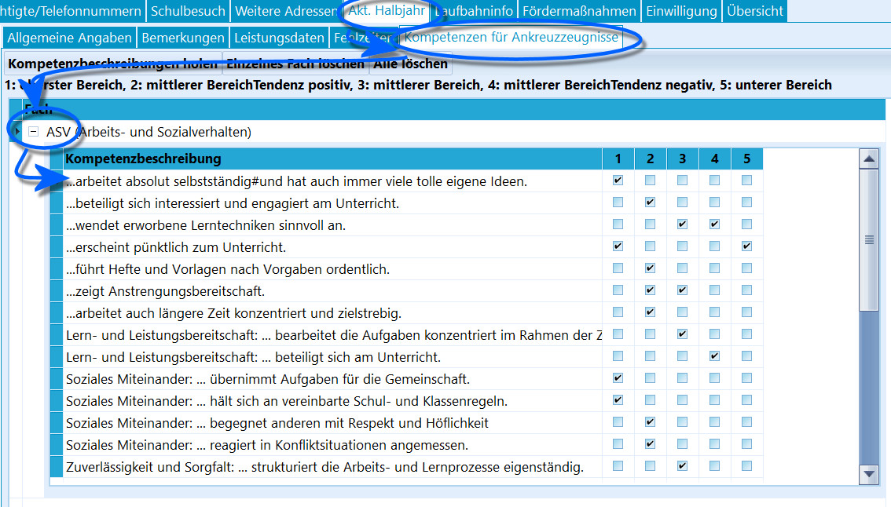

# Grundschulzeugnisse Ankreuzzeugnis (Tutorial)

## Schule vorbereiten

Zuerst muss die Schule für das Eintrage von Leistungsdaten vorbereitet
werden. Folgen Sie hierzu der Anleitung im Wiki-Artikel zur

WIKILINK: Grundschulzeugnisse_Vorbereitung_für_Text-_und_Ankreuzzeugnisse_(Tutorial).

 Weiterhin muss bei einer Klasse die Verwendung von
Ankreuzkompetenzen aktiviert sein. Gehen Sie hierzu über *Kataloge* in
die **Klassen- und Versetzungstabelle**.Klicken Sie auf die Klassen, in der die Ankreuzkompetenzen verwendet
werden sollen und setzen Sie den Haken bei **In dieser Klasse werden
Ankreuzzeugnisse verwendet**.  

 Nun steht unter *Schüler ➜ Akt. Halbjahr* für Schüler
dieser Klasse der neue Reiter **Kompetenzen für Ankreuzzeugnisse** zur
Verfügung und die Kompetenzen können auch per Gruppenprozess zugewiesen
werden.Hierzu folgt mehr weiter unten.  

## Kompetenzen definieren

 Die zur Wahl stehenden Ankreuzkompetenzen werden über den
*Kataloge* ➜ **Angaben für Ankreuzzeugnisse** erzeugt und dann
bearbeitet.Wählen Sie ein **Fach** und einen **Jahrgang**, für den eine Kompetenz
zur Verfügung stehen soll.Kompetenzen werden dann über das **+** bzw. das **-** erzeugt
beziehungsweise entfernt.Wählen Sie auch, für welches **Halbjahr** - oder für beide - die
Kompetenz bewertbar sein soll.Weiterhin kann über die Zahl rechts die **Sortierreihenfolge**
festgelegt werden. Die Sortierung bestimmt, in welcher Reihenfolge die
Kompetenzen auf dem Zeugnis ausgedruckt werden.

\* Für den Jahrgang *E3* werden keine Kompetenzen
angelegt. In diesem Jahrgang werden die für den Jahrgang *E2*
definierten Kompetenzen verwendet.-   Obwohl *ASV - "Arbeits- und Sozialverhalten"* kein tatsächliches
    Fach ist, wird es hier wie eines behandelt.

## Import und Export

Verfügen Sie über eine Datei Excel-Datei mit Vorlagen zum Import,
klicken Sie auf `Import` und wählen Sie diese Datei aus. Die Kompetenzen
stehen nun in SchILD zur Verfügung.

Die hier verwendete Datei wurde im Zeugnisbereich auf der Seite des [MSBfür Schulverwaltungssoftware](https://www.svws.nrw.de) heruntergeladen.
An gleicher Stelle finden Sie ebenfalls eine leere Excel-Datei, die für
das Befüllen mit eigenen Einträgen vorbereitet wird.Entsprechend können Floskeln zur Weitergabe und -verarbeitung auch
**exportiert** werden.Klicken Sie hierzu auf `Export` und wählen Sie einen Dateispeicherort.

Um Ankreuzkompetenzen beziehungsweise Textbausteine für
einen anderen Jahrgang einzugeben, können Sie die Arbeit sparen, indem
Sie die Eingabe einmal für einen Jahrgang vornehmen, dann exportieren
und in einem Tabellenverarbeitungsprogramm ihrer Wahl die Zeilen
kopieren beziehungsweise den Jahrgang ändern. Dann nehmen Sie einen
erneuten Export vor.

\* Fachfloskeln und ähnliche Einträge werden für den
Jahrgang *E3* nicht eingegeben. Hier werden die Floskeln des Jahrgangs
*E2* verwendet.-   Sie können Floskeln mit einem Doppelklick direkt in das Textfenster
    übernehmen.
-   Wenn das *Kürzel* mit einem **\#** beginnt, kann eine Floskel auch
    über das Eintippen *"#KÜRZEL"* eingegeben werden.
-   Bei der Eingabe von Floskeln kann der Haken bei **Mehrfache Nennung
    des Vornamens vermeiden** gesetzt werden. Das erste Vorkommen des
    Platzhalters *$Vorname$* wird dann zum Vornamen, folgende Nennungen
    werden zu *er* oder *sie*.

## Unterkategorien

Zu Fächern können auch Unterkategorien gebildet werden. So könnten die
Kompetenzen in *ASV* in die beiden Unterkategorien *"Lern- und
Leistungsbereitschaft* und *Zuverlässigkeit und Sorgfalt* eingeteilt
werden.Eine Unterkategorie wird durch einen Doppelpunkt **:** kenntlich
gemacht. Hierbei ist alles vor dem Doppelpunkt die Unterkategorie, alles
danach die Kompetenz.` Lern- und Leistungsbereitschaft: ... hält sich an Regeln und Vereinbarungen.`  
` Lern- und Leistungsbereitschaft: ... arbeitet auch längere Zeit konzentriert und zielstrebig.`  
` Lern- und Leistungsbereitschaft: beteiligt sich interessiert und engagiert am Unterricht.`  
` Zuverlässigkeit und Sorgfalt: ... erscheint pünktlich zum Unterricht.`  
` Zuverlässigkeit und Sorgfalt: ... führt Hefte und Vorlagen nach Vorgaben ordentlich.`  
` Zuverlässigkeit und Sorgfalt: ... bietet anderen Hilfe an und kann selber Hilfe annehmen.`

Wurden Unterkategorien gesetzt, führt dies dazu, dass unterhalb von ASV
die Unter-Kompetenzen erst unter **Lern- und Leistungsbereitschaft** und
dann als **Zuverlässigkeit und Sorgfalt** gruppiert werden.Hier im Beispiel wurde die Sortierung so gewählt, dass alle Kompetenzen
ohne Kategorie zuerst erscheinen.

## Definition der Kompetenzstufen

 Unterhalb der Kompetenzen findet sich ein Bereich, in dem
die vergebenen **Kompetenzstufen** definiert werden. Es sind maximal
fünf Stufen möglich.  

## Anzeigen einer Legende

In der *AnkreuzZeugniseinstellungen.ini* lässt sich eine Legende ein-
und ausblenden, in der Sie die Kompetenzstufen erläutern können.` ; - Semikolon entfernen, um Kompetenzerläuterungen mit auszugeben`  
` ; KompetenzErlaeuterung`Entfernen Sie das Semikolon vor der Zeile mit *"KompetenzErlauterung"*
und speichern Sie die Datei, wird die in der Datei
*\_Kompetenz_Erlaeuterung.rtm* aufgeführte Legende ausgegeben. Diese
Datei lässt sich vom Report-Explorer aus aufrufen und bearbeiten.

## Die "Frei definierbare Zeugnisrubrik"

 Weiterhin lässt sich eine **frei definierbare
Zeugnisrubrik** anlegen.Wurde hier eine Kategorie definiert, können die dem zugeordneten
Kompetenzen nun über das Pseudo-**Fach** *Sonstiges* wie üblich erzeugt
werden.Auch hier lassen sich Zeilenumbrüche mit einem **\#** erzwingen (siehe
das Unterkapitel unten).  

## Zeilenumbrüche

Bei den Kompetenzen werden für mehrzeilige Einträge Zeilenumbrüche
automatisch vorgenommen. Das Ergebnis sieht häufig nicht gut aus, da
auch ein Versatz vor der zweiten Zeile fehlt.Mit einem Doppelkreuz (oder auch Raute) **\#** lässt sich ein
Zeilenumbruch erzwingen, dem auch in der zweiten Zeile ein Versatz
vorgestellt wird.  
Ebenso kann in den *Beschreibungen der Kompetenzstufen* ein zweizeiliger
Eintrag mit erzwungenem Zeilenumbruch gesetzt werden.

## Kompetenzen über Leistungsdaten zuweisen

Damit Ankreuzkompetenzen zugewiesen werden können, müssen zuerst die
Fächer in den individuellen Leistungsdaten bei den Schülern hinzugefügt
worden sein. Dies geht individuell über *Schüler ➜ Akt. Halbjahr ➜
Leistungsdaten* oder besser und für große Schülergruppen, zum Beispiel
klassenweise, über *Stundentafeln*.Lesen Sie hierzu das Tutorial zur 

WIKILINK: Grundschulzeugnisse_Vorbereitung_für_Text-_und_Ankreuzzeugnisse_(Tutorial).

Die für eine *Kombination aus Fach und Jahrgang* definierten
Ankreuzkompetenzen lassen sich dann den individuellen Leistungsdaten der
Schüler im Aktuellen Lernabschnitt per Gruppenprozess zuweisen. Gehen
Sie über *Gruppenprozesse ➜ Noten, Zeugnisvorbereitung* ➜
**Ankreuzkompetenzen eintragen**.

Die definierten Ankreuzkompetenzen werden nun zugewiesen und können dann
über *Schüler ➜ Akt. Halbjahr ➜ Leistungsdaten* ➜ **Kompetenzen für
Ankreuzzeugnisse** fachweise gesetzt werden.Im Screenshot sind die Kompetenzen für das *Arbeits- und
Sozialverhalten* zu sehen. Öffnen und schließen Sie die Kompetenzen für
jedes Fach mit einem Klick auf das "**-**" vor dem Fach.

#Es ist möglich, auch mehrere Kompetenzstufen
anzuklicken.1.  Wird bei einer Kompetenz kein Haken gesetzt, werden alle Checkboxen
    auf dem Zeugnis durchstrichen.

Ist das Feld zu klein, ziehen sie das übergeordnete Feld
*Fach* breiter, dann lässt sich auch der Bereich für die
*kompetenzbeschreibung* breiter ziehen. SchILD-NRW speichert Ihre
Feldbreiten für die Zukunft.

  

**Sonderfall Kind in der ersten Klasse im Jahrgang E2:**In Ausnahmefällen kann es vorkommen, dass ein Kind in der ersten Klasse
schon im Jahrgang E2 ist, weil es einen Rücktritt in der
Schuleingangsphase gegeben hat. In solchen Fällen würden bei solchen
Kindern die Kompetenzbeschreibungen des 2. Jahrgangs geholt, was man an
dieser Stelle vermeiden möchte.Gehen Sie dazu auf den Reiter *Individualdaten II* und geben Sie dem
Schüler im Feld **EP-Jahre** die Zahl 1. Bitte denken Sie daran, diesen
Schülern später nach dem Wechsel in die 2. Klasse dann den Wert
**EP-Jahre** ''3 zu geben.

Dieser Wert ist nicht statistikrelevant, wird aber bei der Berechnung
der Schulbesuchsjahre berücksichtigt. Für weiterführende Schulen ist
dann aber sehr wichtig, dass der Verbleib in der Schuleingangsphase
korrekt erfasst und kommuniziert wird, da sich hiernach auch das Ende
der Vollzeitschulpflicht verschieben könnte.

