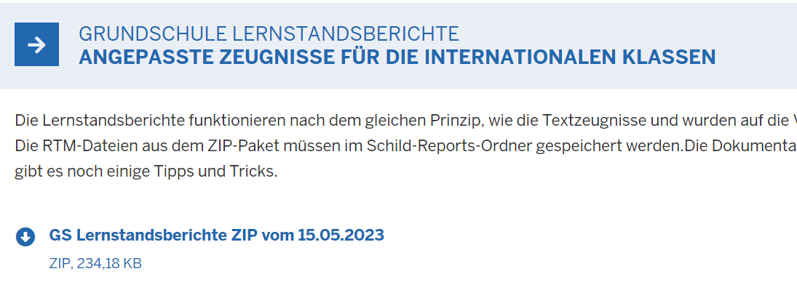

# Grundschulzeugnisse Lernstandsberichte (Tutorial)

Die Lernstandsberichte funktionieren nach dem gleichen Prinzip, wie die
Textzeugnisse und wurden auf die Vorgaben des MSB zu den
Lernstandsberichten angepasst.Laden Sie Lernstandsberichte bitte auf der [Seite fürSchulverwaltungssoftware des MSB](https://www.svws.nrw.de) herunter.Nachdem der Report entpackt und in der Ordnerstruktur unterhalb von
*Schild-Reports* angelegt wurde und nachdem die passenden Floskeln
generiert wurden, können die Lernstandsberichte verwendet werden.