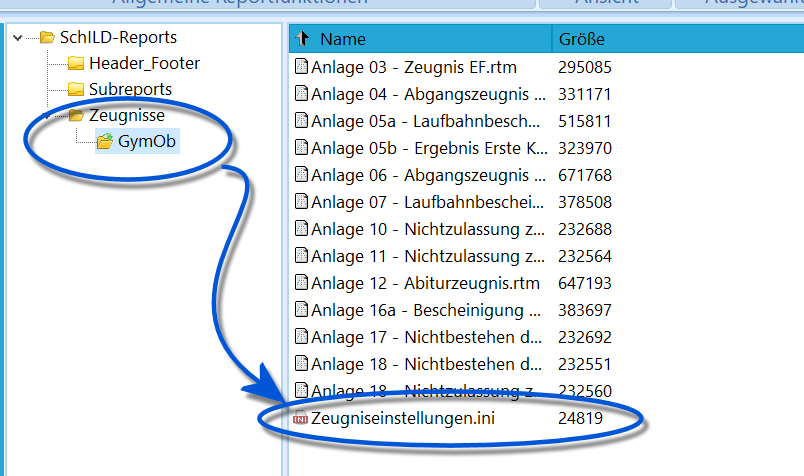
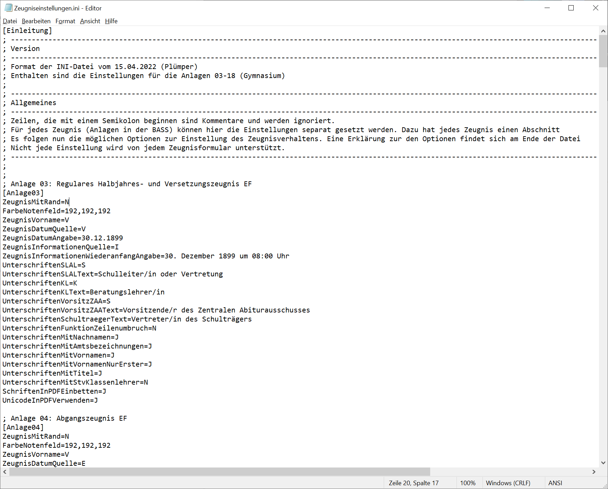

# Inhalt & Layout von Zeugnissen konfigurieren

## Zeugnisse über die Zeugniseinstellungen.ini konfigurieren

Nun sollte noch die Einstellungsdatei *Zeugniseinstellungen.ini*
konfiguriert werden und dann sind die Zeugnisse verwendbar.

## Aufbau der ini-Datei

 Die Zeugnisse können - und müssen - über Einstellungen in
der Datei *Zeugniseinstellungen.ini* konfiguriert werden. Es öffnet sich
der in Ihrem Windows eingestellte Texteditor.    

 Die Datei ist wie folgt aufgebaut: Alle Zeilen, die mit
einem "**;**" beginnen, sind *Kommentare* und werden damit nicht
maschinell verarbeitet, sondern sind Erklärungen für den Menschen.Beispiel:` ; Zeilen, die mit einem Semikolon beginnen sind Kommentare und werden ignoriert.`Zeilen, die einen Block mit einem Wort in \[Eckigen Klammern\]
einleiten, gelten für eine bestimmte Zeugnisanlage. Typischerweise
befindet sich darüber eine Zeile mit einem Kommentar, die erläutert, um
was für eine Anlage es sich handelt.Beispiel:` ; Anlage 03: Regulares Halbjahres- und Versetzungszeugnis EF`  
` [Anlage03]`  Dann folgen Zeilen, die ein bestimmtes Verhalten des Zeugnisformulars
steuern. Diese Zeilen bestehen aus "Option"**=**"Konfiguration der
Option". Mächte man also ein Zeugnis *ohne* Rand drucken, wird dies
durch das Verhalten *ZeugnisMitRand* gesteuert. Es gibt hier den
Schalter "J" für "Ja" und "N" für "Nein", wäre für diese Anlage also in
der .ini folgendes einzutragen:` ZeugnisMitRand=N`Für ein Zeugnis *mit* Rand wäre somit zu setzen:` ZeugnisMitRand=J`Am Ende der Datei, unter den Einstellungen für alle von ihr gesteuerten
Zeugnisformulare, folgt eine Erklärung aller möglichen *Optionen* (vor
dem "=") und der jeweils zugelassenen Konfiguration (nach dem "="). Die
Konfiguration ist oftmals nur ein *Buchstabe*, kann aber auch *Texte*
enthalten.  

## Zeugnisoptionen und ihre Einstellmöglichkeiten

Diese Tabelle dient der Übersichtlichkeit, möglicherweise bietet ein
bestimmtes Zeugnisformular noch weitere Optionen an. Diese wären dann
dem Fuß der jeweiligen *Zeugniseinstellungen.ini* zu entnehmen.
| Option Mit Erklärung | Mögliche Steuerungszeichen | Detailerklärung |
| --- | --- | --- |
| ZeugnisMitRand | J | "J" steht überall für "Ja". Druckt das Zeugnis mit Rand. |
| N | N steht überall für "Nein". Druckt das Zeugnis ohne Rand. |  |
| A3ZeugnisSeiten14Ausblenden Wenn diese Option aktiviert wird, werden die Seiten 1 und 4 eines A3 Zeugnisses nicht ausgedruckt und gleichzeitig der Duplexdruck deaktiviert. | J | Druckt entsprechend der Erklärung nur die inneren Seiten 2 und 3. |
| N | Druckt ganz normal alle Seiten im Duplexdruck. |  |
| FarbeNotenfeld legt die Hintergrundfarbe der Notenfelder auf dem Zeugnis fest. | Zahl,Zahl,Zahl z.B. 255,20,170 | Die Angabe erfolgt in der Form R,G,B (Rot,Grün,Blau). Standardwert ist 192,192,192 und führt zu einem Grau. Mögliche Angaben: R,G,B, jeweils mit ganzzahligen Werten von 0 bis 255. |
| ZeugnisVorname Legt fest, wie der Vorname auf dem Zeugnis erzeugt werden soll. Unabhängig von der Wahl der Option wird bei einem leeren Feld "Weitere VornamenQ" das Feld Vorname verwendet. | V | Nur das Feld "Vorname" verwenden. |
| W | Das Feld "Vorname" durch Anhängen des Feldes "Weitere Vornamen" ergänzen. |  |
| A | Nur das Feld "Weitere Vornamen" verwenden, es wird damit als "ALLE Vornamen" interpretiert. |  |
| ZeugnisDatumQuelle legt fest, wie das Zeugnisformular das Zeugnisdatum ermitteln soll. Bleibt der Eintrag leer, wird ein Auswahldialog eingeblendet. | Z | Zeugnisdatum des akt. Lernabschnittes. |
| K | Konferenzdatum des akt. Lernabschnittes. |  |
| V | entspricht Z ("Zeugnisdatum") mit der Ausnahme für nicht versetzte Schüler im zweiten Halbjahr , dort wird K ("Konferenzdatum") gewählt. |  |
| E | Entlassdatum aus SchILD. |  |
| S | Schulwechseldatum aus ScHILD. |  |
| A | Aktuelles Tagesdatum. |  |
| I | Datum aus INI-Datei (Siehe "ZeugnisDatumAngabe" unten). |  |
| F | Abfrage beim Formularaufruf, öffnet beim Formularaufruf ein Eingabefenster. |  |
| ZeugnisDatumAngabe | Datum des Zeugnisses im Kurzformat z.B. 28.07.24 | wird nur gewählt, wenn die ZeugnisDatumQuelle I für "Ini-Datei" ist. |
| ZeugnisInformationenQuelle legt fest, woher das Zeugnisformular die Angaben zum Wiederanfang des Unterrichts und zum Elternsprechtag nehmen soll. Bleibt der Eintrag leer, so werden die Informationen ignoriert. | F | Abfrage beim Formularaufruf. |
| I | Angaben aus INI-Datei (Siehe "ZeugnisInformationenWiederanfangAngabe" unten). |  |
| D | Aus der Datenbank (dieses Feature ist noch in SchILD zu implementieren). |  |
| ZeugnisInformationenWiederanfangAngabe | Text mit Datum und Uhrzeit z.B. 1. August 2024 um 08:00 Uhr | wird nur gewählt, wenn die ZeugnisInformationenQuelle I für "Ini-Datei" ist. |
| UnterschriftenSLAL legt fest, ob der Schulleiter oder der Abteilungsleiter das Zeugnis unterschreibt. | S | Schulleitung aus Datenbank. |
| V | Stellvertretende Schulleitung aus der Datenbank. |  |
| A | Abteilungsleitung aus der Datenbank. |  |
| I | Text aus der .ini-Datei ohne Abfrage bei Zeugnisdruck. Der Standardtext wird bei UnterschriftenSLALText festgelegt (siehe unten). |  |
| T | Textabfrage beim Zeugnisdruck. Der Standard ist unter UnterschriftenSLALText (siehe unten) festgelegt, kann bei der Zeugnisgenerierung noch geändert werden. |  |
| UnterschriftenSLALText legt den Standardtext fest, der direkt (wenn UnterschriftenSLAL=I) oder bei Textabfrage (wenn UnterschriftenSLAL=T) für das Unterschriftenfeld der Schul- bzw. Abteilungsleitung voreingestellt ist. Ein im Text eingegebener senkrechter Strich " \| " wird als Zeilenumbruch interpretiert. |  |  |
| Ein Lehrerkürzel; eventuell ein Zusatz MUST,(Schulleiterin) | Gemäß der Kürzels und den Einstellungen (divers Einstellungen, siehe unten) für die Unterschriften werden die Einträge der Lehrkraft übernommen. Falls eine andere Funktion als "Schulleiter" gewünscht ist, kann man diese durch Komma getrennt in Klammern angeben. Format: KÜRZEL,(mein Text). Bei allen auch noch unten kommenden Feldern wird ein KÜRZEL zu dem Format aufgelöst, das durch die Namenseinstellungen weiter unten definiert ist. Je nach Einstellungen würde das Kürzel MUST im Druck zum Beispiel zu "Dr. M. Mustermann, StR". |  |
| exakter Text , z.B. Marie Musterfrau, Stv. Konrektorin | Angabe eines Textes, der genauso unter der Unterschriftenlinie gedruckt werden soll. |  |
| UnterschriftenKL legt fest, welcher Name unter dem Unterschriftenfeld der Klassenleitung steht. | K | Klassenleitung aus Datenbank. |
| I | Text aus INI-Datei unter UnterschriftenKLText ohne Abfrage beim Zeugnisdruck. |  |
| T | Texteingabe bei Zeugnisaufruf. Details siehe unten zu UnterschriftenKLText. |  |
| UnterschriftenKLText legt den Standardtext fest, der direkt (wenn UnterschriftenKL=I) oder bei Textabfrage (wenn UnterschriftenKL=T) für das Unterschriftenfeld der Klassenleitung voreingestellt ist. | Ein Lehrerkürzel,(Optionaler Zusatz) , z.B. MUST, (Beratungslehrer) | Funktioniert analog zu UnterschriftenSLALText (siehe oben). |
| Exakter Text , z.B. MUST, (Koordinator SII) | Funktioniert analog zu UnterschriftenSLALText (siehe oben). |  |
| UnterschriftenVorsitzZAA legt fest, welche Daten für die Unterschrift des Vorsitzenden des Zentralen Abiturausschusses verwendet werden. | S, V, I, T | Die Einstellungen sind ebenso wie bei UnterschriftenSLAL und UnterschriftenKL. Hier steuert UnterschriftenVorsitzZAAText den Inhalt. Mögliche Einträge sind (Details siehe oben): S = Schulleitung aus Datenbank V = stellvertretende Schulleitung aus Datenbank I = Text aus INI-Datei unter UnterschriftenZAAText ohne Abfrage beim Zeugnisdruck T = Textangabe bei Zeugnisaufruf. |
| UnterschriftenVorsitzZAAText ''legt den Standardtext fest, der direkt (wenn UnterschriftenVorsitzZAA=I) oder bei Textabfrage (wenn UnterschriftenVorsitzZAA=T) für das Unterschriftenfeld des ZAA-Vorsitzes voreingestellt ist. Ein im Text eingegebener senkrechter Strich ("Pipe") wird als Zeilenumbruch interpretiert. | Kürzel und Zusatz | Das Verhalten dieses Feldes ist analog zu den oben erläuterten. Ein Kürzel mit einem eventuellen Zusatz wie MUST, (Vorsitz ZAA) |
| exakter Text | Ein Text, wie i.V. Maxi Muster (GeD) |  |
| UnterschriftenSchultraegerText Der hier angegebene Text wird als Unterschriftenbezeichnung des Vertreters des Schulträgers (auf dem Abiturzeugnis) verwendet. Ein senkrechter Strich im Text ("Pipe") wird als Zeilenumbruch interpretiert | Text | z.B. Dr. Glitzerfee, Gemeinde Einhornlichtung |
| UnterschriftenFunktionZeilenumbruch legt fest, ob die Funktionsbezeichnung bei Unterschriften in eine neue Zeile gesetzt werden soll. Gilt nicht, wenn der stv. Beratungslehrer ausgegeben wird. | J | Meier, Abteilungsleiter |
| N | Meier, Abteilungsleiter |  |
| UnterschriftenMitNachnamen legt fest, ob statt der allgemeinen Bezeichnungen der Unterschriftenfelder die Nachnamen der betroffenen Personen verwendet werden sollen. | J | Folgt der Beschreibung und setzt Nachnamen |
| N | Wird hier "N" eingetragen, werden auch keine Vornamen, Titel oder Amtsbezeichnungen gesetzt. Die Optionen weiter unten, welche diese steuern, werden somit ignoriert. |  |
| UnterschriftenMitAmtsbezeichnungen legt fest, ob die Amtsbezeichnungen bei Unterschriften ergänzt werden soll. | J, N |  |
| UnterschriftenMitVornamen legt fest, ob die ersten Buchstaben der Vornamen bei Unterschriften ergänzt werden soll. | J, N |  |
| UnterschriftenMitVornamenNurErster legt fest, ob nur der erste Vorname bei der Option UnterschriftenMitVornamen berücksichtigt werden soll. | J, N |  |
| UnterschriftenMitTitel legt fest, ob ein Titel bei Unterschriften ergänzt werden soll. | J, N | Typischerweise betrifft diese Einstellung Doktortitel. |
| UnterschriftenMitStvKlassenlehrer legt fest, ob auch der stellvert. Klassenlehrer mit in den Unterschriften ausgegeben werden soll. | J | Ist diese Funktion aktiviert, so wird die Einstellung UnterschriftenFunktionZeilenumbruch nicht beachtet. |
| N |  |  |
| AnschreibenRuecksendeangaben Nur für Anschreiben. | Text | Wenn leer , dann werden die Informationen aus der DB genutzt, sofern im Report keine feste Eintragung vorgenommen wurde. |
| AnschreibenVermerkzone Nur für Anschreiben. | Text | Wenn leer , dann werden die Informationen aus dem Report genutzt. |
| AnschreibenInfoblockNameFunktionQuelle nur für Anschreiben gedacht. Legt fest, wie der Infoblock rechts in den Zeilen Name und Funktion gefüllt werden. | U | Person des Unterschriftenfeldes (siehe unten). |
| I | Eintrag aus dieser Ini-Datei (siehe unten). |  |
| K | Keinen Infoblock zeigen. |  |
| Um den Infoblock zu setzen, können folgende Felder mit Text befüllt werden. Diese Informationen werden durch AnschreibenInfoblockNameFunktionQuelle gesteuert. | Text | AnschreibenInfoblockName AnschreibenInfoblockFunktion AnschreibenInfoblockTelefon AnschreibenInfoblockFax AnschreibenInfoblockWeb AnschreibenInfoblockEMail |
| Um dynamische Informationen zu setzen, können folgende Felder genutzt werden. Nur für Anschreiben. |  | AnschreibenDatumsangabe1 AnschreibenDatumsangabe2 AnschreibenFreitext |
| SchulabschlussQuelle legt fest, wo die Abschlusszeugnisse die Informationen zum Schulabschluss entnehmen sollen. | H | Eintrag des Abschlusses im aktuellen Halbjahr. |
| L | Eintrag aus der Liste der Abschlüsse in SchILD (List noch zu in SchILD zu implementieren |  |
| F | Abfrage beim Formularaufruf. |  |
| AlteAbschluesseErfragen ''legt fest, ob der Benutzer nach alten Abschlüssen gefragt werden soll, wenn ein Abgangszeugnis gedruckt werden soll und der zugehörige Abschluss nicht gefunden wurde. | J, N | Alte Abschlüsse liegen eventuell nicht in der Datenbank vor, wenn jemand mit einem Abschluss zur eigenen Schule wechselt, dann aber abgeht, ohne einen höherwertigen Abschluss erreicht zu haben. |
| SchriftenInPDFEinbetten legt fest, ob bei der Erzeugung der PDF-Dateien die verwendete Schrift mit in die PDF eingebettet werden soll. | J | Achtung: Dadurch kann eine einzelne Zeugnis-PDF-Datei mehrere MB groß werden. |
| N |  |  |
| UnicodeInPDFVerwenden legt fest, ob bei der Erzeugung der PDF-Dateien für Texte die Unicode-Codierung verwendet werden soll. | J | Achtung: Dadurch kann eine einzelne Zeugnis-PDF-Datei mehrere MB groß werden. |
| N |  |  |
|  |  |  |
Einstellen von Zeugnisformularen