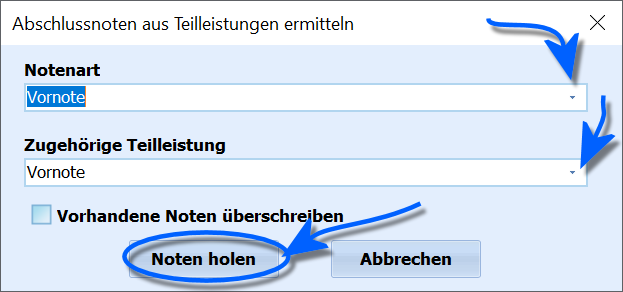

# Kurse algorithmisch markieren (Gruppenprozesse BK-Abschluss)

 Über den Gruppenprozess **Prüfungsnoten aus Teilleistungen
holen** können generell Teilleistungen in den Reiter *Schüler ➜
BK-Abschluss* übernommen werden.

Dies betrifft natürlich die namensgebenden *mündlichen* und
schriftlichen *Prüfungsnoten*, aber auch die *Vornoten*. Bei den
Vornoten ist zu beachten, dass die Noten in den Leistungsdaten des
aktuellen Abschnitts Halbjahresnoten sind, sich die Vornoten aber
entsprechend der jeweiligen Prüfungsordnung Ganzjahresnoten sein können.Weiterhin lassen sich *allgemeinbildende* und *berufsbezogene
Abschlussnoten* aus ihren Teilleistungen mit diesem Gruppenprozess
holen.Im Gruppenprozess ist die **Notenart** zu wählen, diese Einträge
entsprechen den Spalten im Reiter *BK-Abschluss*. Je nach ausgewählter
Schülergruppe stehen nicht alle Teilleistungsarten zur Verfügung.

Die **Zugehörige Teilleistung** enthält die in SchILD-NRW definierten
Teilleistungen. Wählen Sie hier die, in der die passende Note hinterlegt
wurde.Über den Schalter **Vorhandene Noten überschreiben** lässt sich
einstellen, ob vorhandene Noten behalten oder neu aus den Teilleistungen
gesetzt werden.Klicken Sie dann auf `Noten holen`, um den Prozess zu beginnen. Über
*Abbrechen* wird der Prozess beendet, ohne dass eine Änderung an den
Daten durchgeführt wird.