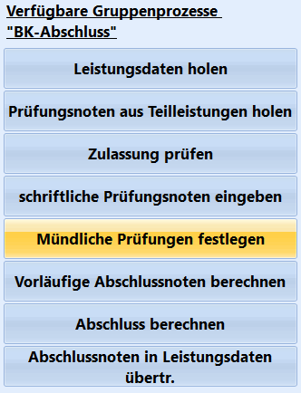

# Mdl. Prüfungen festlegen (Gruppenprozesse BK-Abschluss)

Wurden alle Leistungsdaten und Prüfungsleistungen im Reiter *Schüler ➜
BK-Abschluss* aufgenommen, kann für eine Gruppe auf Bestehensprüfungen
über den Gruppenprozess **Mündliche Prüfungen festlegen** geprüft
werden.Sinnvolle Ergebnisse werden nur bei einer passenden Auswahl der
Schülergruppe erzeugt. Bei Bedarf wird der Haken bei **Mdl. Prüfung** in
*Schüler ➜ BK-Abschluss* gesetzt.

Die *Freiwilligen mündlichen Prüfungen*, sofern sie nach der
Prüfungsordnung vorgesehen sind, werden zusätzlich manuell im Reiter
*BK-Abschluss* gesetzt.