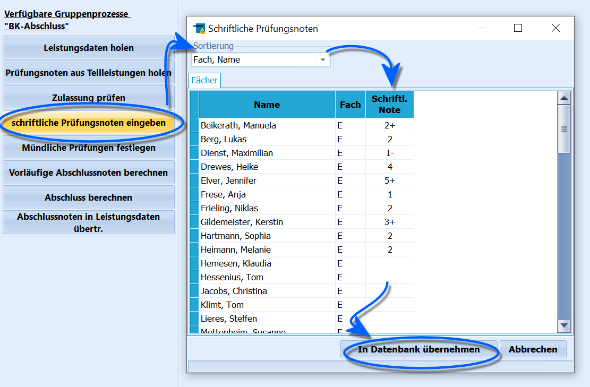

# Prüfungsergebnisse eingeben (Gruppenprozesse BK-Abschluss)

 Über den Gruppenprozess **schriftliche Prüfungsnoten
eingeben** können Prüfungsnoten gesammelt bei einer Schülergruppe in den
Reiter *Schüler ➜ BK-Abschluss* eingetragen werden.Über die **Sortierung** lässt sich nach einem *Fach* filtern, die
Sortierung ist dann alphabetisch nach *Name*.Geben Sie die Noten je nach verwendetem Verfahren mit oder ohne
Tendenzen ein, dann klicken Sie auf `In Datenbank übernehmen`. Die Noten
werden nun bei den Schülern eingetragen. Ein Klick auf *Abbrechen*
beendet den Prozess, ohne Änderungen an der Datenbank vorzunehmen.