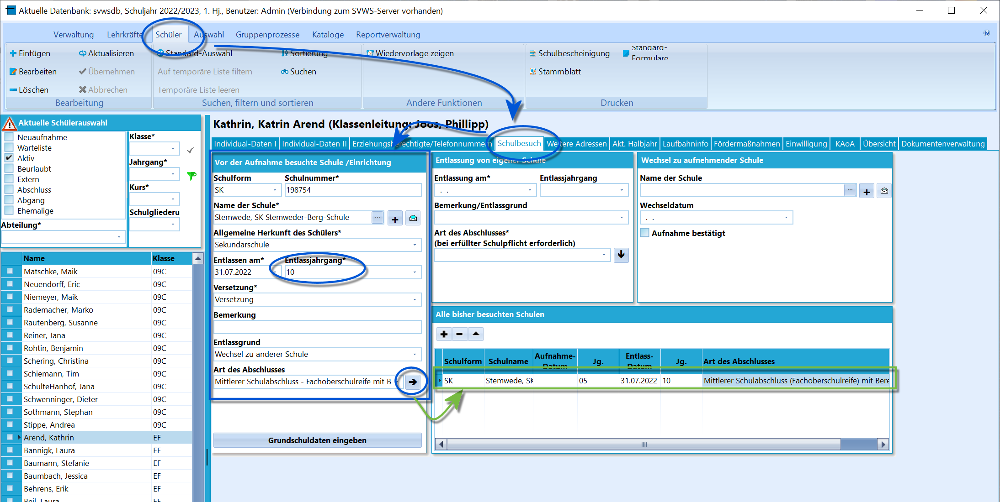
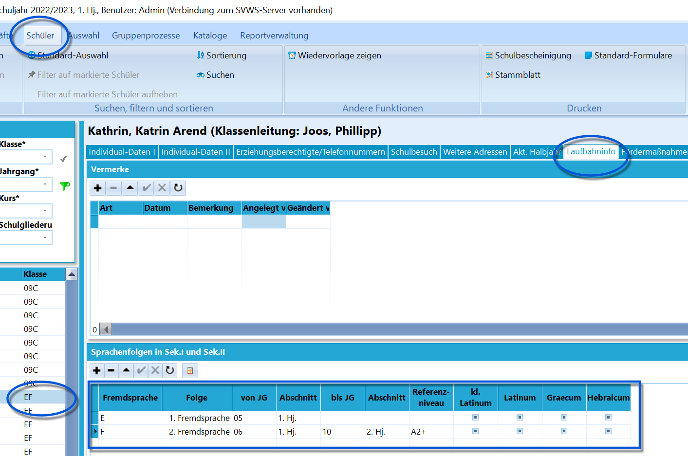

# Sprachenfolge bei Seiteneinsteigern des Gymnasiums in Zeugnissen korrekt ausgeben (Tutorial)

Diese Anleitung beschreibt die korrekte Druckausgabe der Sprachenfolge
bei Seiteneinsteigern aus Haupt- und Realschule, die nach der Klasse 10
zum Gymnasium wechseln und die in der Sekundarstufe I eine zweite
Fremdsprache zum Beispiel von Klasse 8 bis 10 belegt und abgeschlossen
haben.Folgendermaßen muss vorgegangen werden:

 Zuerst ist der *Schulbesuch* zu kontrollieren.

Dieser wird unter *Schüler Schulbesuch* aufgerufen.In diesem Fenster ist die alte Schule mit den Daten und dem korrekten
Entlassjahrgang einzutragen.Übernehmen Sie die Schule mit dem nach rechts gerichteten Pfeil in
**Alle bisher besuchten Schulen**.  

 Geben Sie nun die Sprachenfolge ein.

Die erste Fremdsprache ist Englisch - und, außer, Sie erstellen nun ein
Abgangszeugnis, bislang nicht abgeschlossen und wird also nur mit dem
Beginn der Belegung eingetragen (üblicherweise Englisch ab der Klasse
5, 1. Halbjahr).

Die **zweite Fremdsprache** ist das von 6 bis 10 an der anderen Schule
fertig belegte und hier an der Schule abgeschlossene Französisch. Diese
Sprache wird nun mit den korrekten Abschnittsdaten "**von**" und
"**bis"** befüllt.Gleichermaßen lassen sich weitere begonnene oder auch abgeschlossene
Fremdsprachen eintragen.Tragen Sie das Referenzniveau manuell ein. Sofern ein Latinum, Greacum
oder Hebraicum erreicht, tragen Sie dies ebenfalls - wie immer manuell -
ein.