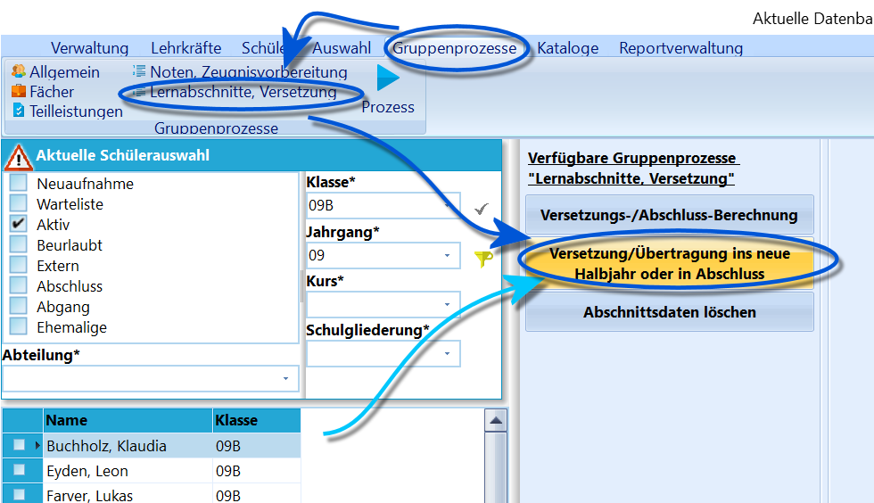
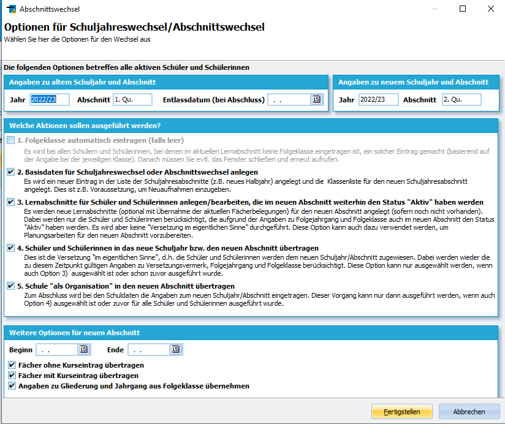

# Versetzung/Übertrag ins neue Halbjahr oder Abschluss (Gruppenprozesse Lernabschnitte, Versetzung)

Dieser Artikel erklärt den Abschnittswechsel in
Sonderfällen.

Diese Vorgehensweise ist nur notwendig, wenn Schülergruppen zu
verschiedenen Zeitpunkten oder von verschiedenen Abteilungsleitungen
versetzt werden müssen.

 Dieser Gruppenprozess wird genutzt, um die im Container
ausgewählte Schülermenge zu versetzen oder ins neue Halbjahr
beziehungsweise in den *Status: Abschluss* zu übertragen.  

## Vorbereitungen

Es sind nun die für jede Versetzung und jeden Abschnittswechsel üblichen
Vorbereitungen zu treffen. Konsultieren Sie bitte die hierzu verfassten
Wiki-Artikel.
1.  Setzen Sie zuerst das **Konferenz-** und bei Bedarf das
    **Zeugnisdatum** für die ausgewählte Schülermenge.  
    Diese Einstellungen können über ''Gruppenprozesse ➜ Noten,
    Zeugnisvorbereitung" und dann **Konferenz- und Zeugnisdatum setzen**
    vorgenommen werden.
2.  Wenn Jahrgänge bearbeitet werden, in denen eine *Versetzung* oder
    *Abschlüsse* vorgesehen sind, startet Sie den Gruppenprozess
    **Versetzungs-/Abschlussberechnung** aus *Gruppenprozesse ➜
    Lernabschnitte, Versetzung* für die gewählte Schülermenge.

Achten Sie darauf, dass alle notwendigen Leistungsdaten
geholt, Mahnungen und Fehlstunden passend eingetragen sind und
eventuelle Lernbereichsnoten gebildet wurden.

  

3. Anschließend drucken Sie eventuelle Zeugnisse entsprechend der
Prüfungsordnung und individuell unterschiedliche Abgangs- oder
Abschlusszeugnisse.<!-- -->  
4. Bearbeiten Sie nun möglicherweise vorliegende Sonderfälle, die nicht
von den automatischen Prozessen abgedeckt sind, wie zum Beispiel Klassen
zugeordnete Flüchtlingskinder.

## Starten des Gruppenprozesses

Es öffnet sich das Fenster "Optionen für
Schuljahreswechsel/Abschnittswechsel", bei dem verschiedene Optionen für
die Übertragung ausgewählt werden können.Oben finden sich die Angaben zum *Alten Schuljahr und Abschnitt* und die
zum *Neuen Schuljahr und Abschnitt*.
Wie bei der üblichen Versetzung auch bauen die Einstellungen aufeinander
auf:
-   Zuerst müssen 2. in der Schule die Basisdaten für einen neuen
    Abschnitt angelegt werden.
-   Dann ist es 3. möglich, für alle gewählten Schüler diesen
    Lernabschnitt einzutragen, um schließlich
-   4\. die eigentliche Versetzung basierend auf den Einträgen für den
    aktuellen Abschnitt durchzuführen - also ob jemand "Versetzt",
    "Nicht versetzt" oder mit einem erlangten Abschluss in den *Status:
    Abschluss* verschoben wird.
-   Schlussendlich kann 5. die Schule als Organisation in den neuen
    Abschnitt übertragen werden. Hier weicht die Ausführung per
    Gruppenprozess für eine Schülerteilmenge von der Versetzung der
    ganzen Schule auf einmal ab.  Dann ist wie bei der generellen Versetzung zu konfigurieren, wie Fächer
zu übernehmen sind.Ein Klick auf `Übernehmen` startet den Gruppenprozess und führt den
Abschnittswechsel so aus, wie es den Versetzungsvermerken bei den
Schülern entspricht und wie die Klassen in *Kataloge ➜ Klassen- und
Versetzungstabelle* eingestellt wurden.