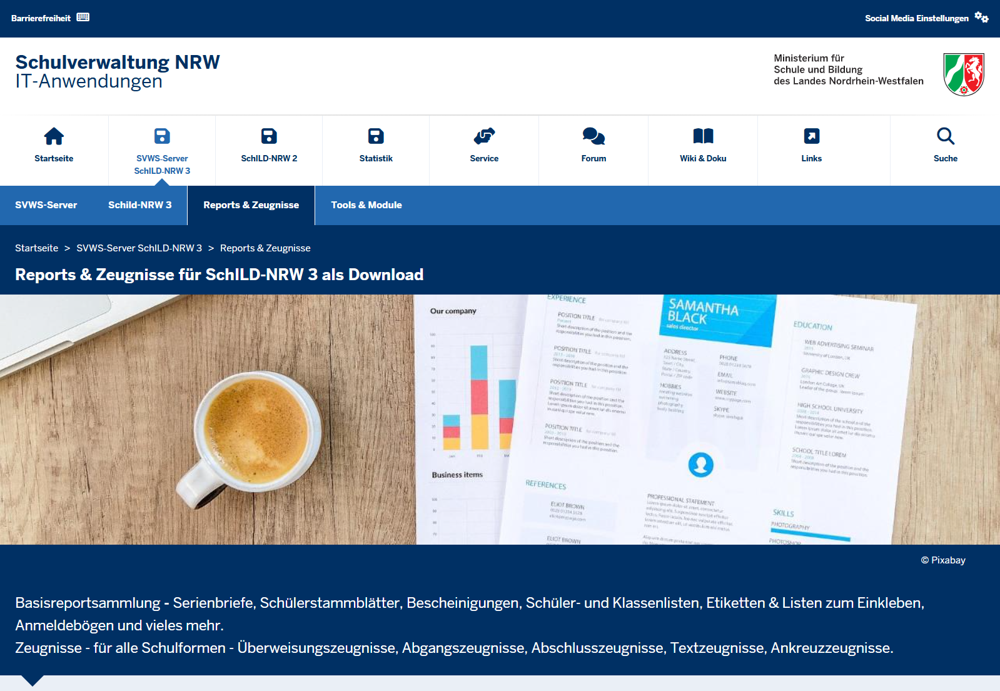
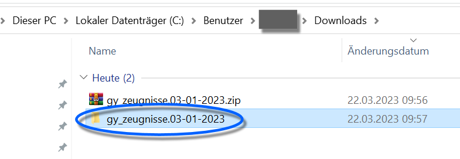
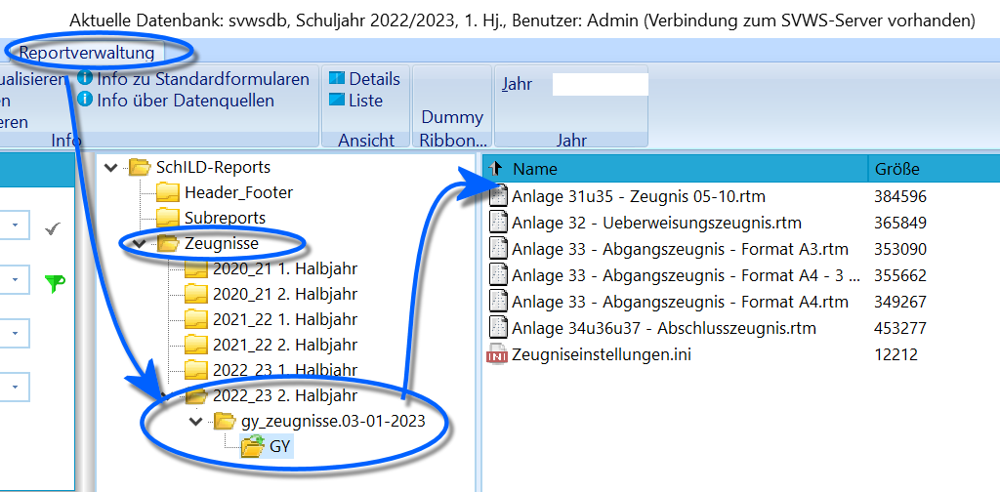
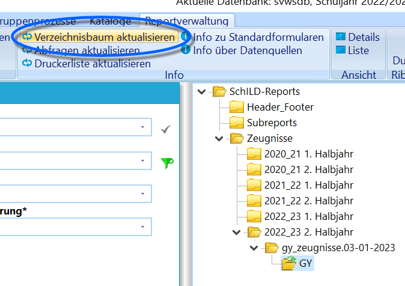

# Zeugnisformulare herunterladen und aktualisieren

## Zeugnisformulare herunterladen

Laden Sie das benötigte Zeugnispaket Ihrer Schulform von GitHub
herunter. Die Download-Links zu allen Zeugnispaketen finden Sie im
Wiki-Artikel 

WIKILINK: Zeugnispakete_auf_GitHub.Unter *SVWS-Server SchILD-NRW 3 ➜ Reports & Zeugnisse* finden Sie neben
Zeugnisformularen für alle Schulformen auch viele weitere Formulare der
Basisreportsammlung.Wählen Sie die Zeugnisse für Ihre Schulform aus und laden Sie diese
herunter.

Die Zeugnisformulare befinden sich in einer gepackten ZIP-Datei. Diese
ist noch nicht direkt in der Reportverwaltung von SchILD-NRW 3
verwendbar.Der Speicherort der ZIP-Datei (zum Beispiel im Download-Ordner) ist
zunächst unerheblich.

## Zeugnisformulare in der Reportstruktur ablegen

Klicken Sie mit der rechten Maustaste auf die ZIP-Datei und entpacken
Sie diese. Wählen Sie als Ziel für das Entpacken das
*SVWS-Arbeitsverzeichnis*. Dort befindet sich der Ordner
**SchILD-Reports**. In diesem Ordner oder in einem passenden Unterordner
müssen die entpackten Zeugnisformulare abgelegt werden.

Wenn Sie in SchILD-NRW 3 die Reportverwaltung geöffnet hatten, während
Sie im Windows-Explorer die Zeugnisse entpackt und kopiert haben, können
Sie den Report-Explorer mit einem Klick auf **Verzeichnisbaum
aktualisieren** auf den aktuellen Stand bringen.