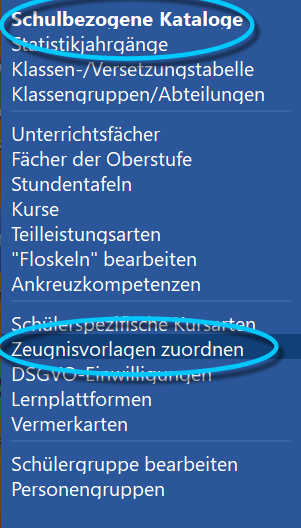
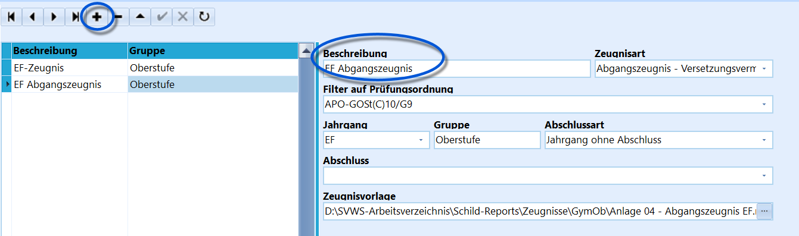

# Zeugnisvorlagen zuordnen (Schulbezogene Kataloge)

Über *Kataloge ➜ Schulbezogene Kataloge* können in SchILD-NRW 3 Reports
als **Zeugnisvorlagen** zugeordnet werden.

Diese lassen sich anschließend deutlich einfacher drucken, da die
einzelnen Reports nicht mehr im Report-Explorer gesucht werden müssen.Der Druck erfolgt anschließend über den Gruppenprozess **Zugeordnete
Zeugnisformulare drucken**.

Klicken Sie auf das Symbol **+**, um einen neuen Eintrag anzulegen.
Geben Sie anschließend direkt eine aussagekräftige **Beschreibung** ein.Tragen Sie danach die weiteren Angaben passend ein:-   **Zeugnisart**
-   **Jahrgang**
-   gegebenenfalls **Abschlussart** und **Abschluss**Bei einem Jahrgang ohne Abschluss wird in der *Abschlussart* der Wert
*Jahrgang ohne Abschluss* eingetragen; das Feld *Abschluss* bleibt in
diesem Fall leer.Fügen Sie zusätzlich eine **Gruppe** hinzu. Dadurch lassen sich die
Vorlagen besser unterscheiden. Im Gruppenprozess **Zugeordnete
Zeugnisformulare drucken** kann später gezielt nach dieser Gruppe
gefiltert werden.Wählen Sie abschließend den passenden Report als **Zeugnisvorlage** aus.
Die aktuellen Zeugnisreports werden regelmäßig über die Webseite des MSB
für Schulverwaltungssoftware bereitgestellt.